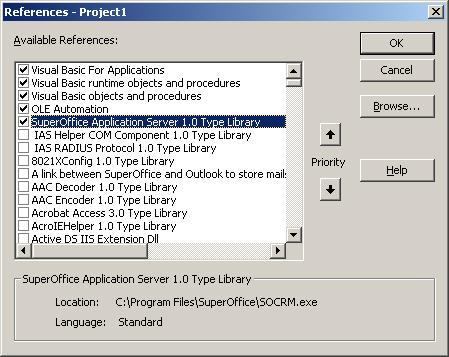

Interacting with the SuperOffice client
=======================================

### Creating an COM object to work with

`SuperOffice.Application` lives inside `SOCRM.EXE`, and is available when the SuperOffice application is running. 
It does not require login as it shares the login with the CRM client.



It's a Singleton, meaning that when you create it and you’ll  get the one the user is running or it will start SuperOffice if it’s not running. 
SOApplication does not require a separate logon, as you will share the users logon.
You can share the database connection with the Application.

```vb
 Set app = CreateObject("SuperOffice.Application")
 ' the app is now ready to use
```

Throwing away the application object will not close the application window.

```vb
 Set app = Nothing
 ' the window remains on screen
```


It exposes the Current values as properties

```vb
msgbox Application.CurrentContact.Name
```


Allows you to drive the Application

```vb
objSO.Context.CurrentPanel = enCtxContact
```


Control the user interface using the protocol or the application object.
------------------------------------------------------------------------

* Can access the database
* Can access the current values from the application – UI updates as you change things.
* Can update fields in dialogs via current objects.
* Changes will be saved automatically.

Web panels give you easy integration and extensibility

### Switch to another Contact

Go to Contact \#3:

```vb
SoApp.CurrentContact.ChangeIdentity 3`
```

### Set field values

```vb
 SoApp.CurrentContact.department = "Development"
 SoApp.Save
```

### Switch to another Panel

* Show me the Contact view with Main Card and Appointments

```vb
SoApp.Context.CurrentPanel = enCtxContact
SoApp.Context.CurrentSubMode = enSubCtxMain
SoApp.Context.CurrentPanel = enCtxAppointment
```

The SuperOffice protocol is another way of controlling the user interface:
--------------------------------------------------------------------------

The SO Protocol looks like this: `superoffice:contact.main.appointment`

### Application.Context

Returns info on what panel, tabs are selected

  `Application.Context.CurrentPanel` 

You can manually switch the GUI to a particular panel or bring up a particular dialog.
Display the contact panel, main tab

```vb
  App.Context.CurrentPanel =  enCtxContact
  App.Context.CurrentSubMode = enSubCtxMain
```

#### Display the person dialog

```vb
App.Context.CurrentPanel = enCtxPerson
```


### Turns edit mode on or off in the current panel

```vb
Application.Context.EditMode = true
```

### Application.Context – can display dialogs too
#### Display the appointment dialog

```vb
App.Context.CurrentPanel =  enCtxAppointment
```

#### Display the person dialog (implies switch to contact panel)

```vb
App.Context.CurrentPanel = enCtxPerson
```

#### Display the person dialog (without switch to contact panel)

```vb
App.Context.CurrentPanel = enCtxPersonOnly
```

#### Display the sale dialog

```vb
App.Context.CurrentPanel = enCtxSaleOnly
```

#### Display the document dialog

```vb
App.Context.CurrentPanel = enCtxDocumentOnly
```

#### Display the list of invitations

```vb
App.Context.CurrentPanel = enCtxInvitiations
```

Application.Context – can change the date and associate you are looking at
--------------------------------------------------------------------------

#### Display the diary for today

```vb
App.Context.DiaryDate =  date()
```


#### Display the diary for tomorrow

```vb
App.Context.DiaryDate =  date()+1
```

#### Display the diary for the current user

```vb
App.Context.DiaryAssociateId =  app.Database.UserAssociateId
```

#### Display the diary for the owner of the current contact

```vb
App.Context.DiaryAssociateId = app.CurrentContact.Associate.Identity
```

Notice that when you change CurrentSale, the Current Contact, Person and Project are automatically set for you

This mechanism is at the heart of SuperOffice and it helps the system anticipate the user.

Setting the Current Sale, Appointment or Document all work in the same way.
They all implicitly set the current Contact, Person and Project to their own contact, person and project values.

This can be unexpected at first, but you can use it to your advantage.
