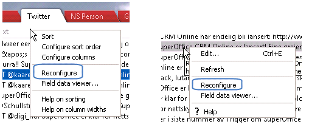
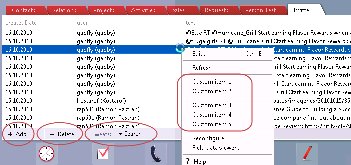
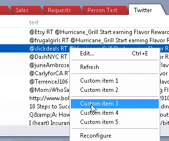

You can access developer utilities from both the column and row right-click context menus if the &lt;view&gt; has "reconfigure" enabled in the XML config file:



Using Reconfigure you will be able to make changes to the xml configuration file and easily test it.

At the top of SoCrm Archives.config, you will find documentation for the known section, keys and values.

Let us make some changes to an archive and then use the Reconfigure command:

Adding Context Menu Items

```xml
       <!-- TWITTER: Twitter -->
      <archive providername="Twitter" guiname="Twitter1">
        .......
        <view columnspacer="false" debugcolumns="false" columnheader="true" reconfigure="true" fielddataviewer="true">
        </view>
        <toolbar add="true" delete="true" countinfo="true" entities="list" listboxlabel="Tweats:" ></toolbar>
        <contextmenuitems>
          <contextmenuitem name="Custom item 1" id="1" />
          <contextmenuitem name="Custom item 2" id="2" />
          <contextmenuitem name="separator" />
          <contextmenuitem name="Custom item 3" id="3" />
          <contextmenuitem name="Custom item 4" id="4" />
          <contextmenuitem name="Custom item 5" id="whatever you like" />
        </contextmenuitems>
        <columns>
         <column name="createdDate" default="true" widthoverride="18c"/>
         <column name="user" default="true" widthoverride="24%"/>
         <column name="text" default="true" widthoverride="66%"/>
         <column name="source" default="true" widthoverride="10%" displaytypeoverride="webaddress"/>
        </columns>
      </archive>
```

After using Reconfigure the archive will look like this:



Observe:

-   The Entities checkboxes are now assembled into a drop down list. This action makes them *exclusive* which means it is not possible to select more than 1 entity at a time.
-   Add and Delete mini buttons have appeared.
-   Context menu items have appeared.


If we select a custom context menu item:



if you have defined a ***DoTweat*** script method in the configuration file, your script method will be called, else the default *OnDoEntity method* will be called:

Note that the menuItemId parameter passed to the DoTweat method is "3" (the id from the config file).