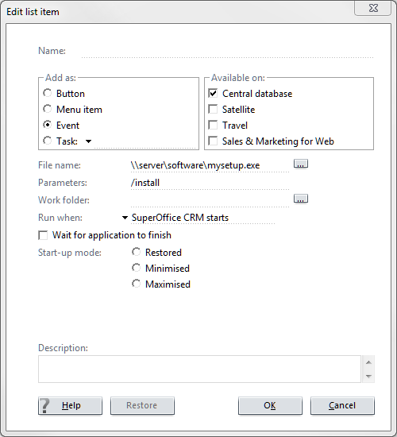

You can use SOCRM to deploy your application.

Use the SOADMIN **Lists** panel, and edit the **Application** list.

Add a new application that is an EVENT - RUN WHEN = STARTUP

When the SOCRM client starts up, it will execute any STARTUP applications it has registered.

If you trigger your application with a parameter (/Register or /Install for example) then your application will be installed, not run.

Note that your app will be run every time it starts, so you should avoid doing too much work if you have already been installed.

It will run as the current user, so it will need UAC/Admin  permission to write to the program-files folder.