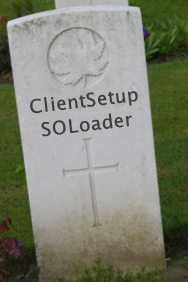

SOLoader is not supported any more.

Applications can't be responsible for copying files, changing the registry, updating COM registrations, registering with Control panel, uninstallation, creation of shortcuts, elevating rights (UAC) anymore. Things became too complicated.

You should use [an MSI installer](@guideUsingMSI)

You can use [an EXE installer](@guideDeployUsingNSIS) possibly [pushing it out using SOCRM](@guideDeployUsingSOCRM).

You could use [the old SOLoader](@guideDeploySoLoader) - but it's not really supported any more.

[SOCRM can update itself](@guideDeploySOCRMSelfUpdate) from a central location.