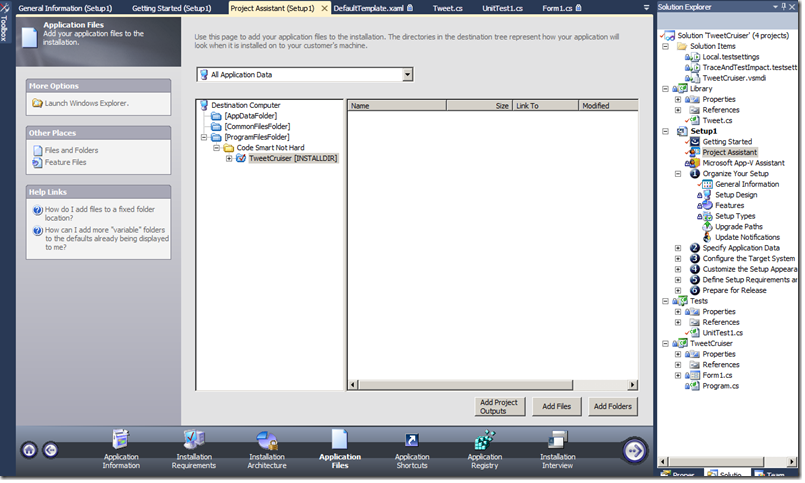
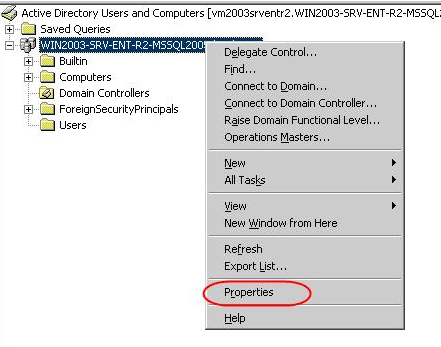
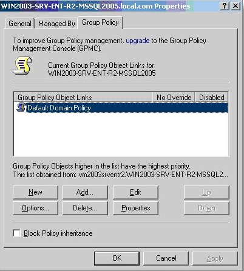
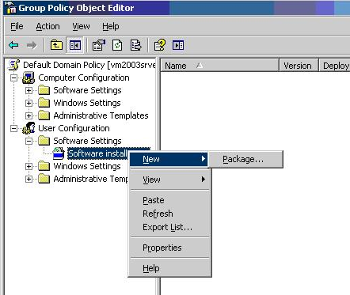
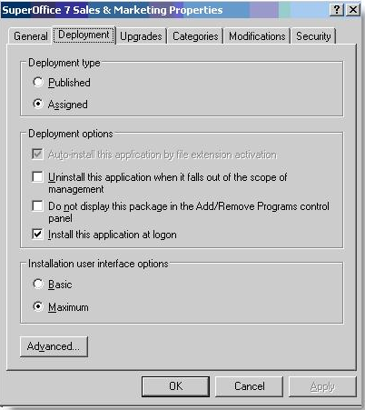

Visual Studio 2010 includes InstallShield LE which can be used to make MSI installers.  It is the replacement for the old Visual Studio SETUP projects.

The MSI installer should deploy your files - if you are deploying to the SuperOffice client folder, then you should be careful to exclude the built-in DLLs like SOCORE.DLL, SODATABASE.DLL, SUPEROFFICEDB.DLL etc - since replacing part of the client installation isn't going to work so well.

Making a MSI installer is mainly a matter of copying files and registry settings.  An MSI is essentially a database that describes what settings/files are supposed to end up where.  More complex setups will require using custom-actions, small DLLs that contain functions and logic. Some useful actions are included in the InstallShield package.

The advantage of putting together an MSI installer is that it documents (in great detail) what you are putting on the client machine, and what you need in order to work. The pain in putting together an MSI file usually comes from discovering all the hidden dependencies in your software.

The instructions in an MSI database are run through using a special installer service, which means that files and registry values can be written to protected locations like ProgramFiles without waking the UAC prompt.

MSI Tools
=========

Some alternatives for MSI creation are:

-   WiX: <http://wix.sourceforge.net/>
-   MSICreate: <http://www.cornerhouse.ca/Cornerhouse/msi.html>
-   InstallAware: <http://www.installaware.com/>
-   Advanced Installer: <http://www.advancedinstaller.com/>
-   A more complete list: <http://www.appdeploy.com/techhomes/windowsinstaller.asp>

MSI is its own universe, and it's well worth reading up on the details of the technology:

The basics: <http://makemsi-manual.dennisbareis.com/windows_installer_basics.htm>

MSI and Automatic Deployment over AD
====================================

The installer service can also be triggered remotely - so an Active Directory Group Policy Object (GPO) can be used to roll-out an MSI package to a bunch of users automatically.

Open the **Active Directory User and Computers***.*

Right click on the domain and choose Properties.

Choose Group Policy

Note: You can create your policy here. I used the Default Domain Policy.

Choose User configuration -&gt; Software Settings-&gt;Software Installation
Right click on Software Installation and choose New –Package

Select the .MSI file in folder you shared.

Then choose advanced and click on OK. This can take a minute or 2 before the next screen appears.

You can change the package name if you want.

Go to the next tab **Deployment**: Choose Assigned, Install this application at logon and Maximum

Press apply  and your done !!

You can run **gpupdate /force** on the client to force the policy.

Just logoff and login and your SuperOffice client will be pushed automatically when you login into windows !!

And the user doesn't has to be local-admin.