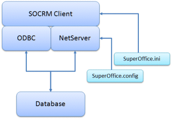

NetServer is always running inside the SuperOffice Sales & Marketing 7 windows client.

 

NetServer is used to [set up the database connection and authenticate the user](@NetServerIn7) in 7.

You can easily [make your NetServer based application connect to the same database](@guideUsingSameDatabaseAs7) as the SOCRM client.

NetServer can be used to [automatically log-in to web panels](@TempVarNetServer%20integration) implemented using NetServer on the web-server side. You can easily and safely share login information with web-services.