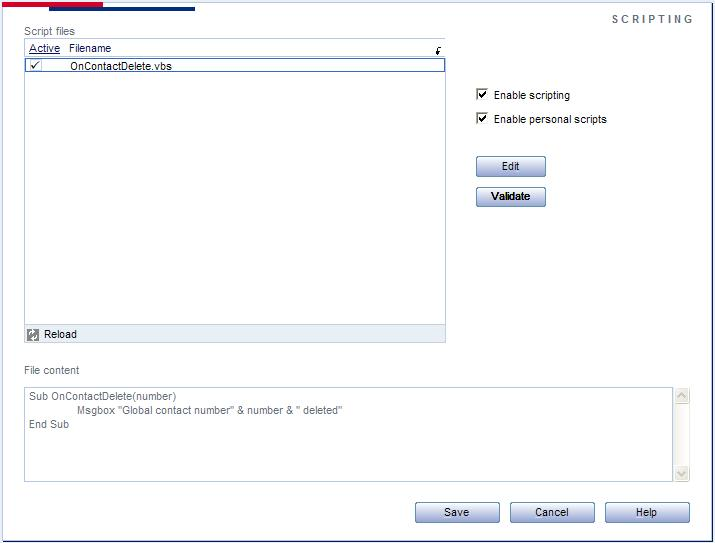

### Design overview

Note that scripting must be enabled in SOADMIN first. This requires an Expander license.

The scripting panel does not appear if the database does not have an Expander license.

**On SOCRM application start:**
    ScriptControlManager is initialized
    If Scripting is enabled
       ScriptControlManager searches SO\_Arc\\
       If personal scripts are enabled – ScriptControlManager also searches all SO\_ARC\\Personal folders
          SOCRM checks each script file to see if it is enabled in SOADMIN
          For each script file that is enabled
              ScriptControl reads the file
              Functions in file are loaded
          Next
       End if
     End if

**On event fired inside SOCRM:**
    SOCRM notifies script system of an event
        Script system searches for script files that implement a matching function name.
            If a matching function name is found, then
                 for each of the matching script files
                     execute the appropriate function with parameters
                 next
            End if
            If SOEventPublisher is active Then
                 Call event publisher with event name and parameter.
            End if

### Script Engine preference enabled

The user should be allowed to decide if the Script Engine should be enabled or disabled via the preference system. This will easily be done by setting the preference via the admin client. New prime data must be inserted into the database.  We will actually implement some GUI to do this, because then the user will have the possibillity to enable/disable each of the global script files. (Note that this does not include personal scripts from so\_arc\\personal, since this would mean a bigger scope increase, and Admin would have to be extended with another scriptpanel, now we implement only one.)

The idea for this panel, is that it should display all the global script files, and when selected, the contents are showed in the window below. This is non-editable. In the list, the user can select which of the script files are to be active. There will also be checkboxes for ‘Enable scripting’ and ‘Enable personal scripts’. (See screenshot below)

We will implement this as a standard Admin panel, with the Script file list as a SuperList, which will use the ScriptControlManager to get a complete list of global scripts and display it in the list. When an item in the list is selected, the contents of the file will be read and insterted into the File content text box. The checkboxes in the list is to decide if the scriptfile is to be used or not.  The preference system will here be used to save the settings, where the name and setting(enabled/disabled) of each scriptfile is saved into the preference table in the database.

On application startup, the ScriptControlManager will use this preference to check which files are to be read.  On application startup, the ScriptControlManager will also check for ‘Personal scripts enabled’, and if this is turned off, the whole process of checking the personal folders for script files will be dropped. ScriptControlManager  will of course also check the preference ‘Scripting enabled’, and if this is turned off, the ScriptControlManager will not create any ScriptControlWrapper objects.

### Script editing in SOAdmin

There are two buttons in Admin Scripting panel, Edit and Validate.
The Edit button will open the selected scriptfile in Windows default text editor (normally notepad), so the file is ready to be edited on the fly. After editing a script, the user can select the file in the file list and press ‘Validate’. The Script system will then check the script file for syntax errors and display the result in a messagebox, and in a textbox in the panel if an error occur.

|                         |                                                                                                                                                             |
|-------------------------|-------------------------------------------------------------------------------------------------------------------------------------------------------------|
|  | **NOTE**: This validation does not care about logical errors or programmatical flaws, it is a direct syntax checker and will only respond to syntax errors. |

### Encoded Scripts

SCRENC.EXE
Microsoft Script Encoder
Turns

  MsgBox "Hello world"

into

  [\#@~^GQAAAA==\\ko$K6,JCV^GPSW.V9J~@\#@&JwcAAA](#@~%5EGQAAAA==/ko$K6,JCV%5EGPSW.V9J~@#@&JwcAAA)==^\#~@

  The source code of an encoded script will not be visible in the File contect box, and the edit box will only bring up the encoded script.

### Debugging

From SIX SR1 we will write error messages to the SuperOffice error logfile
