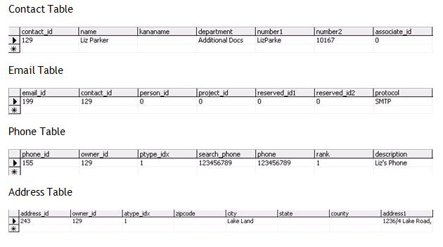

Examples are written using [Scripting Engine](refScriptingEngine.md). You can use the below code segment within any event, so once that particular event is fired it creates a new contact. You should store the script file in the Scripts folder in SO\_ARC.

How we can create a new Contact using SuperOffice Application Object.

This text may be copied to the notepad, and saved as a \*.vbs file under the name of the SoScriptingEvent called.

Sub OnCurrentContactNotModified
Dim newContact
Dim newMail
Dim enTableCntry
enTableCntry=19
Dim enTableBusiness
enTableBusiness=61
Dim newPhone
Set newContact = Database.CreateContact
newContact.SetDefaults
newContact.Name = "Liz Parker"
newContact.Department = "Additional Docs"
Set newMail = newContact.Emails.Add("<liz@parker.com>", "Liz's Email")
newContact.Country = Database.GetListItemByName(enTableCntry, "Norway")
newContact.Business = Database.GetListItemByName(enTableBusiness, "Bank/Finans")
Set newPhone = newContact.Phones.Add("123456789", "Liz's Phone")
newContact.PostalAddress.Address1 = "1236/4 Lake Road, Lake View. Lake Land."
newContact.PostalAddress.City = "Lake Land"
newContact.Save
SOMessageBox "Contact Has been Saved"
End Sub

And the data will be added to the respective tables as shown:

