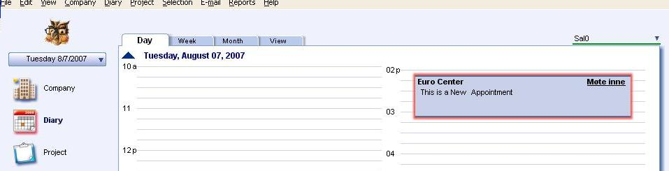

Examples are written using [Scripting Engine](@refScriptingEngine). We can create a new appointment by using scripts. Below code segment shows the way to create a new appointment.  You can use the below code segment within any event, so once that particular event is fired it creates a new appointment. You should store the script file in the Scripts folder in SO\_ARC.

Set soApnt = Database.CreateAppointment
soApnt.SetDefaults
soApnt.Contact = CurrentContact
soApnt.Description = "This is a New Appointment"
soApnt.Save

After creating a new appointment by the user, user can see the newly created appointment by selecting the “day” option from the mini card. Once clicked on the date which new appointment is created on the calendar, it will show the detail description about the appointment as shown below.

