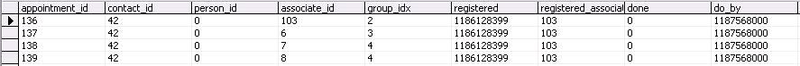
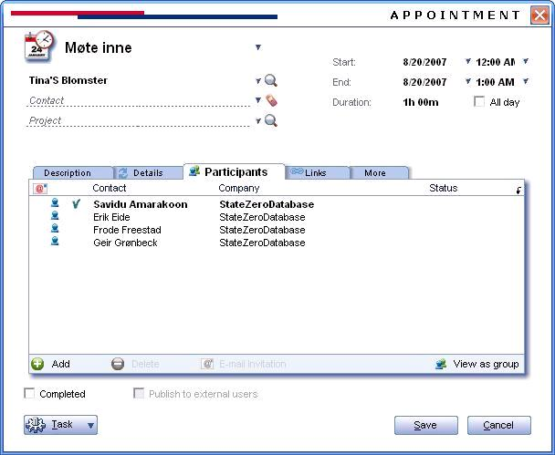

Examples are written using [Scripting Engine](@refScriptingEngine). You can use the below code segment within any event (sub OnCurrentXXX), so once that particular event is fired it creates a new appointment with three invited persons. You should store the script file in the Scripts folder in SO\_ARC.

This example shows us how we can create an Appointment and send Invitations to the invitees using SuperOffice Application Object.
This text may be copied to the notepad, and saved as a \*.vbs file.

Dim newAppointment
Dim newPerson1
Dim newPerson2
Dim newPerson3
Set newAppointment = Database.CreateAppointment
newAppointment.SetDefaults
newAppointment.DoBy = "2007, 8, 20"
newAppointment.Location = "Old meeting room"
newAppointment.Associate = Database.GetAssociate(103)
Set newPerson1 = Database.GetPerson(14)
Set newPerson2 = Database.GetPerson(15)
Set newPerson3 = Database.GetPerson(16)
newAppointment.AddParticipant newPerson1, false
newAppointment.AddParticipant newPerson2, false
newAppointment.AddParticipant newPerson3, false
newAppointment.Save
SOMessageBox "Invitations has been sent to all recipients"

And the data will be added to the respective tables as shown:
Appointment Table, note the mother\_id of the invitees appointment record will in this example be 136.

The add Appointment and its invitees can be seen through the GUI as shown below.

