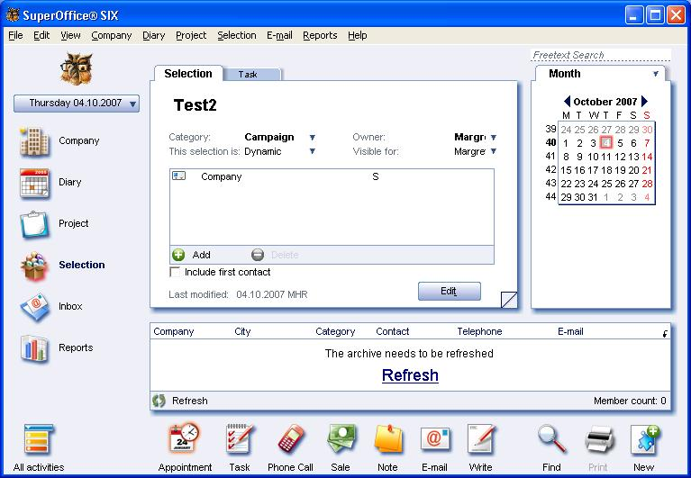

Examples are written using [Scripting Engine](refScriptingEngine.md). You can use the below code segment within any event, so once that particular event is fired it creates a new dynamic selection. You should store the script file in the Scripts folder in SO\_ARC.

This example will show us how we can create a Dynamic Selection with a couple of criteria using the scripting engine.
This text may be copied to the notepad, and saved as a \*.vbs file.

Dim newSelection
Dim newCriteria
Dim selectionMem
Dim enSelTypeDynamicContact
enSelTypeDynamicContact = 1
Set newSelection = Database.CreateSelection
newSelection.SetDefaults
newSelection.Type = enSelTypeDynamicContact
newSelection.Name = "Test2"
newSelection.Save
set newCriteria = newSelection.Criteria.NewCriterion( "contact.name", enBeginsWith )
newCriteria.Values.AddString("S")
newSelection.criteria.Add(newCriteria)
newSelection.Save
SOMessageBox "Selection has been created"

Once the above script has been called the result can be seen as follows.

