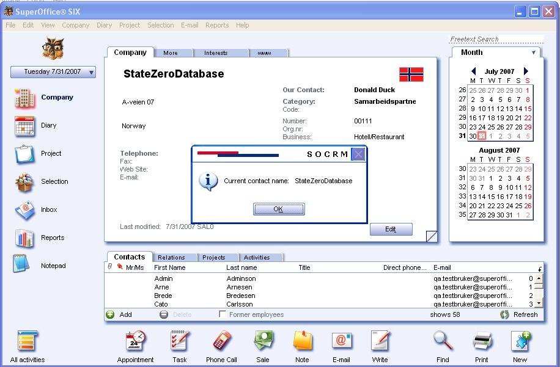

To show contact entity data on the WinGui we have used [scripts](refScriptingEngine.md). By using the script we can show the data which are included in the contact entity. In here we will be discussing how we can display the name of the contact entity in WinGui.
We store the scripts in a Scripts folder - in SO\_ARC\\SCRIPTS.
We also need to enable scripting in the admin client and turn on this particular script before it will work.
Newly added script file is OnEditContactClicked.vbs and it includes the script given below.

Sub OnEditContactClicked()
    somessagebox "Current contact name:   " & CurrentContact.Name
End Sub

Once user clicks on the “Edit” button on the contact form, SoMessageBox will pop up showing the current contact name as shown below.

Script OnEditContactClicked is fired once the user clicks on the “Edit” button on contact form.
The Scripting Engine would call for events that are fired through the external event mechanism. Some events which we can use trough the scripting engine are OnCurrentContactCreated, OnEditContactClicked,  OnContactDeleted,  OnStartup, OnShutdown, etc.