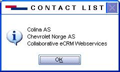

Examples are written using [Scripting Engine](refScriptingEngine.md). You can use the below code segment within any event, so once that particular event is fired it creates a new appointment and invite. You should store the script file in the Scripts folder in SO\_ARC.

We can search for Contacts by using SAINT values using SuperOffice Application Object. Note - Saint requires a separate license.
This text may be copied to the notepad, and saved as a \*.vbs file under the name of the SoScriptingEvent called.

Dim newFind
Dim newContacts
Dim newContact
Dim msgSet newFind = Database.Find
Set newContacts = newFind.ContactsWithActiveStatusMonitor(2)
For Each newContact in newContacts
msg = msg & newContact.Name
msg = msg & Chr(13) & Chr(10)
Next
SOMessageBox msg, "Contact List"

Once the above script has been called the following message will be displayed (data may vary).

