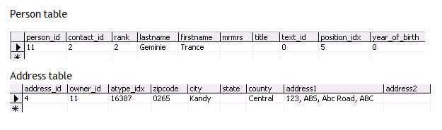

Examples are written using [Scripting Engine](@refScriptingEngine). You can use the below code segment within any event, so once that particular event is fired it creates a new contact. You should store the script file in the Scripts folder in SO\_ARC.

We can update a Person using SuperOffice Application Object.
This text may be copied to the notepad, and saved as a \*.vbs file under the name of the SoScriptingEvent called.

Dim newPerson
Dim enTablePersPos
enTablePersPos = 76
Set newPerson = Database.Getperson(11)
newPerson.firstname = "Trance"
newPerson.lastname = "Geminie"
newPerson.Address.Address1 = "123, ABS, Abc Road, ABC"
newPerson.Address.City = "Kandy"
newPerson.Address.County = "Central"
newPerson.Position = Database.GetListItemByName(enTablePersPos, "Markedsføring")
newPerson.save
SOMessageBox "Person has been Updated"

And the data will be added to the respective tables as shown:

