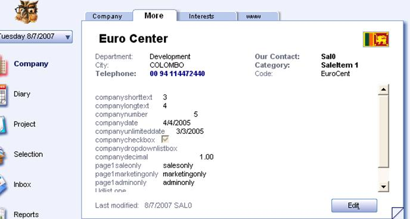

User defined fields are loaded when clicked the “More” tag on the contact page. By using a script we can update the user define data.
We can create a new vbscript file to execute when the user clicks on “OK” button.

Sub OnCurrentContactSaved()
Set soUdef = CurrentContact.UDef
soUdef.byname("companyshorttext").Value="3"
soUdef.byname("companylongtext").Value="4"
soUdef.byname("companynumber").Value="5"
soUdef.byname("companydate").Value="4/4/2005"
soUdef.byname("page1saleonly").Value="salesonly"
soUdef.byname("page1marketingonly").Value="marketingonly"
soUdef.byname("page1adminonly").Value="adminonly"
CurrentContact.UDef=soUdef
CurrentContact.Save
end Sub

We have store the scripts in a Scripts folder - in SO\_ARC\\SCRIPTS.
We also need to enable scripting in the admin client and turn on this particular script before it works.
OnCurrentContactSaved is used as the event in the event engine which will execute this script.
SOCRM client shows the updated user defined fields shown as below.

