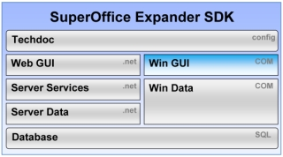

  

Expander SDK: Windows Client GUI API Documentation
==================================================

This is the documentation of SuperOffice CRM 8.1 (24. november 2017).

This section focuses on user interface customization, scripting, events and the associated programming model for the windows client. The web-panel section also applies to the web-client, more information on [Techdoc](http://techdoc.superoffice.com/?sixCustomizing.html).

Plug-ins and more complex programming topics are covered in the Data-Access APIs.

Find out [what is new in SuperOffice CRM 7.1](What's%20new%20in%207.1.md).

[Get started with using the SuperOffice Client SDK](getting_started.md)

[Common issues when upgrading from SIX](@Upgrading_from_SIX)

Go straight to the <see cref="IApplication">Application Object</see> reference.