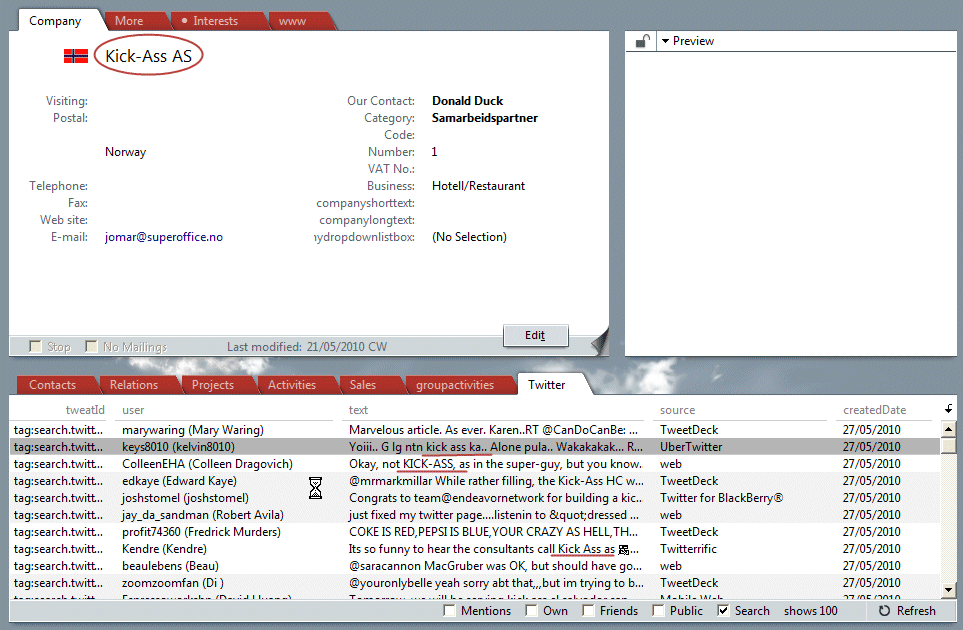

You can add NetServer based custom archive providers to the SOCRM user interface.

These custom archives are configurable and can be linked to current entities, just like the built-in archives.

By adding the NetServer plugins to the SUPEROFFICE.CONFIG file, these data providers can be used to populate grids almost anywhere in the SOCRM client.

Customizing where the data is shown is done using a separate config file.

These data providers can be enhanced using scripts to provide editing capabilities.  Currently, we have implemented to Script messages:

-   OnShowEntity( string linkHint )
-   OnEditEntity( string linkHint )

Using a script, a partner can now put up a dialog for Showing/Editing entities unknown to us.