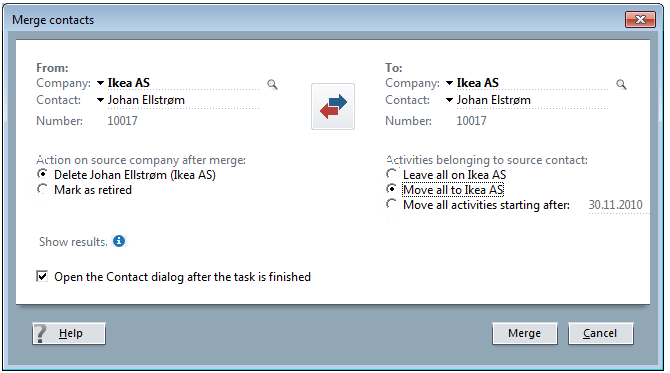

Copy Company: make a copy of a company - duplicating phone numbers, urls, addresses, but not activities, persons.

Merge Company: combine two companies into one.

Move person: A person is moved from one company to another company.

Merge two persons. One person is merged with another person. The resulting person data is a blend of data from both persons where data form one of the persons is selected as the preferred data.  (Two persons becomes one person).

When moving and merging persons, the activities associated with the source person can optionally be moved along with the person. Alternatively the activities are assigned to the source persons own company

Moves and Merges are possible on satellites + travel. The Move + Merge operations are re-played when databases are synchronized, so that any stragglers are caught and moved/merged to the right location.

A new functional right is implemented to control access to :

-   ManagePerson:  User is  granted the right to merge and move persons

This functional right overrides the data rights matrix on activities.
i.e. even if the user can't normally edit the person's activities the activities will be moved as part of a move/merge operation.

New COM methods:
----------------

Contact.MergeTo( TargetContact )

Contact.Copy( newName, new Dept )

Person.MoveTo(contact )

Person.MergeTo( person)

 

Project.MergeTo( project )