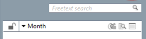

The main new features in CRM 7 are (also take a look at the IDatabase help file for more information):

-   New license system: user-levels are replaced by roles that the admin can define.
-   New [authentication system](@Authentication): totally redesigned and rewritten in Seven
-   [Sale management](@Sale_management)
-   [Selections of anything](@Selections_of_anything). With shadow contacts you may now combine data in new and exiting ways.
-   Easier installing and maintaining using MSI installer
-   The merge of SuperOffice CRM and eJournal database and technology
-   Find - new search system using NetServer archive providers
-   [Configure archives](@Configure_archives)
-   [Merge companies, projects or contacts](@Move_and_merge)
-   [Move a person](@Move_and_merge)
-   Location and resource scheduling

All wrapped in a new look and feel with attention to details

Examples:

-   Quick launch of mini panels
-   Lock mini panel
-   Available meeting rooms
-   Invitations
-   Navigator
-   Ask to go on travel
    and more

New in COM
==========

New methods and objects are [listed here](@New_COM_APIs).