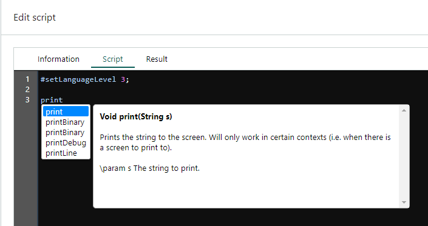

*Intellisense* is a code completion tool. Think of it as an embedded API reference.



It can help you to:

* reduce typos and other common mistakes
* pick the appropriate method
* check the type of variables and parameters
* reduce the need for memorizing names and external look-ups

## Built-in intellisense

The SuperOffice CRMScript interpreter offers intellisense for the built-in classes and global functions.

**To bring up intellisense:**

1. Start typing and then press **Ctrl+Space**.
2. Use the arrow-keys to go up and down the list. The description is shown to the right.
3. Press **Enter** to add the selected item to your code.

## User-defined intellisense

You can also add intellisense for your own structs (including variables), global functions, and global variables.

User-defined intellisense uses the **signature** of the struct, function, or variable plus **any comment directly preceding** it.

```crmscript
struct Person {
  // This is the name of the person
  String name;

  // This is the age of the person
  Integer age;
};
```

### Add intellisense descriptions

The signature is automatically picked up, but you have to define the descriptive text yourself.

Simply add a comment **directly above** the signature, without any line-breaks in between.

You can use both styles of comments:

* // line comment
* /\* block comment \*/

```crmscript
// This is the name of the person
String name;

/* This is the age of the person
   Never ask a woman about her age
*/
Integer age;
```

> [!NOTE]
> Trailing (end-of-line) comments are ignored. You might have to change your comment style to accommodate intellisense.

```crmscript
String name; // This comment doesn't show as intellisense
```

### Bring up custom intellisense

1. Add intellisense descriptions to your CRMScript.
2. Click **Apply**.
3. Start typing and then press **Ctrl+Space**.

It is essential that you save your script to update the in-memory intellisense reference.

> [!TIP]
> Inside a struct, you can type `this.` to get intellisense for its variables. (Save the declarations first.)

### How it works

The custom intellisense is kept in a separate intellisense-array than the built-in classes and functions.

When you save a CRMScript (click **Apply**), `ajax.fcgi?action=getScriptIntellisense` is called to parse the script and update the array.

### Limitations

* Due to security concerns, you **may not use HTML** to style your comments. The displayed intellisense description will be plain text only.

* Local function variables are not available because the CRMScript intellisense is not context-aware. It can't determine which local variables are available in your current scope.
