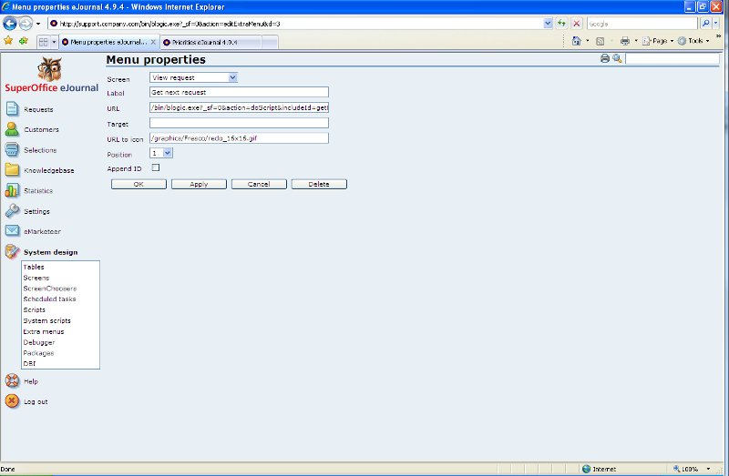
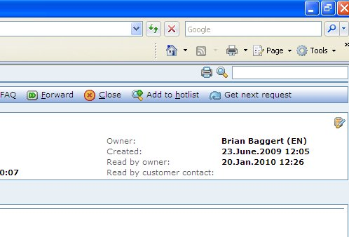

<properties date="2016-06-24"
/>

Creating a script

Creating a script to get most important request
-----------------------------------------------

In order to make sure requests are managed according to the chosen method, we can create a script which picks the most important request (open, unassigned) for a user (taking into account category membership) and assigns it to the current user. The script can then be available as a button in the "View request" screen, and perhabs also in the menu, so that users easily can get assigned whatever request is the most urgent one right now. This script is a very clear parallel to call-center systems which assigns the most urgent phone call to the next available agent. Here is the body of the script:

`SearchEngine se;se.addField("ticket.id");se.addField("ticket.title");se.addField("ticket.deadline");se.addCriteria("ticket.category.(category_membership->category_id).user_id",  "OperatorEquals", getVariable("activeUser"), "OperatorAnd", 0);se.addCriteria("ticket.owned_by",  "OperatorEquals", "1", "OperatorAnd", 0);se.addCriteria("ticket.status",  "OperatorEquals", "1", "OperatorAnd", 0);se.addOrder("ticket.deadline",  true);`

`se.execute();if (!se.eof()){  Ticket theTicket;   theTicket.load(se.getField(0).toInteger());   theTicket.setValue("ownedBy", getVariable("activeUser"));   theTicket.save();  setVariable("url", getProgramTicket() +  "&action=listTicket&ticketId=" + theTicket.getValue("id"));}else   exitWithMessage("There are no more unassigned open requests in your  categories");`

The script will search for requests which are open and unassigned in the categories the current user is a member of and order by deadline. Then the first request will be assigned, and the user will be redirected to it. If no requests are available (empty queue), a simple message is displayed. This script can then easily be connected to a menu as shown in this screen shot:

When working with requests, the users will now have a new button which allows them to get the next request from the queue, according to how we want requests to managed in our team:

 

 

 

 

Sverre Hjelm 1/20/2010 12:31:56 PM
