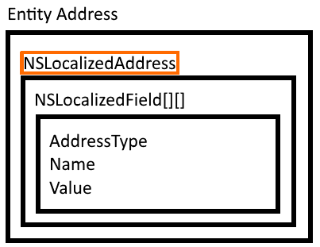

Addresses are commonly formatted according to local conventions.

Due to the dynamic nature of addresses, address fields in the SuperOffice UI appear differently depending on the selected country for any particular [company](./company.md) or [person](./customer.md).

SuperOffice data structures are generic to support multiple address variants. All address fields belong to a structure called `NSLocalizedAddress`.



This is a multi-dimensional array of `NSLocalizedField`:

* The 1st dimension contains each address line.
* The 2nd contains each field in that line.

Example: Norway and France have 4 and 3 lines respectively. Notice how it varies which lines have 1 or 2 elements.


> [!NOTE]
> Some company addresses contain only a postal address while others contain both postal and street addresses. You need to check the `AddressType` to know which type of address information it is!

## Get address info

### NSLocalizedField[][] getFormattedAddress()

Fetches the formatted address of the company.

```crmscript!
Company c;
c.load(2);
NSLocalizedField[][] address;
address = c.getFormattedAddress();

for (Integer i = 0; i < address.length(); i++) {
  for (Integer j = 0; j < address[i].length(); j++) {
    print(address[i][j].GetLabel() + ":" + address[i][j].GetName() + ":" + address[i][j].GetValue() + ":" + address[i][j].GetTooltip() + ":" + address[i][j].GetValueLength().toString() + ":" + address[i][j].GetAddressType() + " ");
  }
  print("\n");
}
```

### Get address using the contact agent

```crmscript
NSContactAgent contactAgent;

NSContactEntity contact = contactAgent.GetContactEntity(2);
NSAddress address = contact.GetAddress();
NSLocalizedField[][] fields = address.GetLocalizedAddress();
```

Then you can use a double for-loop to iterate and print fields (as we did in the previous example).

## Set address info

Writing address information back to this data structure can be challenging if the consumer application has a less dynamic address structure than SuperOffice CRM. You need to format their address data structure into 1 that SuperOffice understands.

> [!TIP]
> You can use the **pre-defined field names** to locate the same info in a corresponding external data structure. You can also flatten the address into a Map.

### Void setFormattedAddress(NSLocalizedField[][] addr)

Sets the formatted address of the company.

```crmscript
Company c;
c.load(2);
NSLocalizedField[][] address;
address[0][0].SetValue("NO-" + address[0][0].GetValue());
c.setFormattedAddress(address);
c.save();
```

Adds "NO-" to the 1st address field.

### Set address using the contact agent

```crmscript
NSContactAgent contactAgent;
NSContactEntity contact = contactAgent.GetContactEntity(2);

NSAddress address = contact.GetAddress();

NSLocalizedField[][] localAdr = address.GetLocalizedAddress();
localAdr[1][0].SetValue("Götabergsgatan 22");
localAdr[2][0].SetValue("Götabergsgatan 22");

address.SetLocalizedAddress(localAdr);
contact.SetAddress(address);
contactAgent.SaveContactEntity(contact);
```

## Reference

### NSLocalizedField properties

| Property     | Description                                         |
|:-------------|:----------------------------------------------------|
| AddressType  | determines which type of address a field belongs to |
| Name         | key                                                 |
| Value        | corresponding value from the database               |

### Address types

| Type                 | Belongs to | Description                              |
|:---------------------|:-----------|------------------------------------------|
| ContactPostalAddress | company    | a company's postal address               |
| ContactStreetAddress | company    | a company's physical or visiting address |
| PersonStreetAddress  | person     | a contact person address                 |

### Pre-defined address field names

There are 2 separate groups of fields, 1 for person and 1 for company (contact).

| For person | For company    |
|------------|----------------|
| Address1   | PostalAddress1 |
| Address2   | PostalAddress2 |
| Address3   | PostalAddress3 |
| City       | PostalCity     |
| County     | PostalCounty   |
| State      | PostalState    |
| Zipcode    | PostalZipcode  |
|            | StreetAddress1 |
|            | StreetAddress2 |
|            | StreetAddress3 |
|            | StreetCity     |
|            | StreetCounty   |
|            | StreetState    |
|            | StreetZipcode  |

> [!TIP]
> The **Postal** and **Street** prefix reflect the address type (ContactPostalAddress or ContactStreetAddress).
