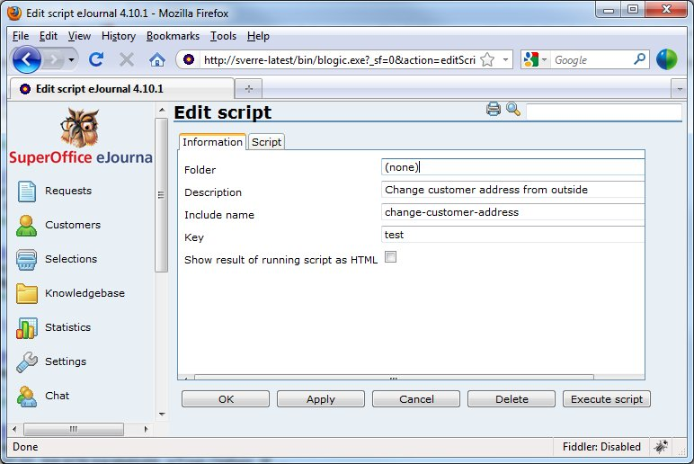

<properties date="2016-06-24"
/>

Create a custom form in the Customer Care Center

Create a custom form in the Customer Care Center
=============================================================

This article shows you how to create a custom form in the Customer Care Center to allow modifying a customer

By default, we have a page in the customer care center allowing the customer to change his/her name, password and any extra fields, such as an address or interest flags used for subscriptions to eMarketing messages. In many cases, our standard page will suffice. However, if you need something a bit more customized, here is an example of how to create another page in the customer care center, allowing the customer to modify "something" :-)

Most pages in the customer care center uses the simplified Parser-language. In this scenario, I will rather use an ejScript created from within eJournal. This also allows me to edit the script without having to access the disk on the eJournal server.

You can execute any script in eJournal from the customer care center, given that you have the id and the key for the script. The URL should be `.../bin/customer.exe?action=safeParse&includeId=the-include-id&key=the-key` where the-include-id and the-key are values you specify when creating the ejScript.

1. autolist
