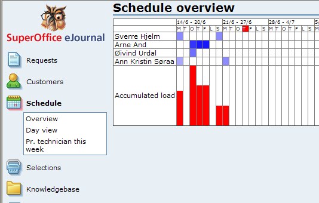
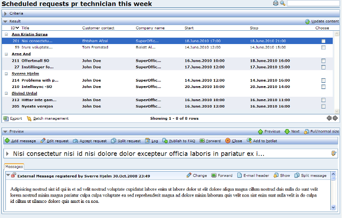

<properties date="2016-06-24"
/>

The simple user interface
-------------------------

A lot of the required user interface for interacting with these fields comes automagically when the fields are added:

* To list/add/edit technicians, simply click Request -&gt; Tables in the left menu. All available extra tables are listed, and you can perform straightforward CRUD (Create, Read, Update, Delete) on the new technician table.
* To schedule a request, simply use the normal New request/Edit request/Add message screen. Underneath the "Extra fields" tab, you will find our new fields: Start, Stop and Technician. It is not calendar drag-n-drop, but it works. Note that this screen will not warn if appointments collide.

 
-

Some more advanced screens
--------------------------

When scheduling technicians, it is interesting to quickly being able to view their workload both from a distance (i.e. workload for a month or more), and also close up (i.e. a single day). To accomplish this, I have created two custom screens. The first screen is a rather custom report, which uses an ejScript component to print a table showing the future (and slightly past) workload for our techies:

The report shows the workload for each technician for a time period starting monday last week and continuing some weeks into the future. The cell for a given technician-day is marked with a color shade, ranging from white (no load) to dark blue (8 hours load). At the bottom, there is a histogram, showing the accumulated workload for all technicians for that given day. Hovering a cell with the mouse will display more information. This report is meant to give a quick overview of how much available resources you might have in the close future.

On a more detailed level, I have a screen which shows the scheduled appointments for a given day:

This screen uses the Planner control, which quite easily allows you to graphically show a typical day view.

Finally, I have created a selection which lists all requests which are scheduled for this week grouped by technician:

This is just a normal request list ("Find requests"), but with some other default columns and a grouping.
