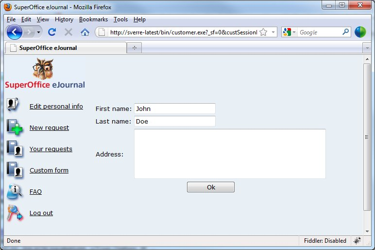
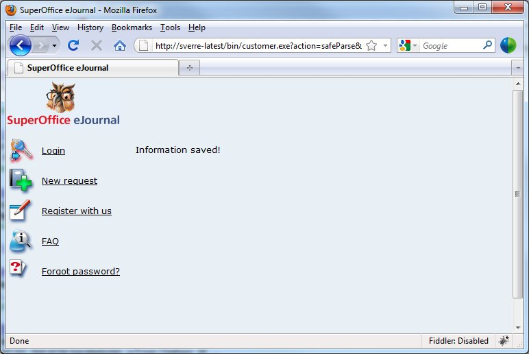

<properties date="2016-06-24"
/>

Customer Center ejScript

In this example, I have created a new ejScript with the following values:

Include-id: change-customer-information

Key: test

Body:

%EJSCRIPT\_START%
&lt;%
Customer theCustomer;
theCustomer.load(getParserVariable("customer.id").toInteger());

if (getCgiVariable("ok") != "")
{
  theCustomer.setValue("firstname", getCgiVariable("firstname"));
  theCustomer.setValue("lastname", getCgiVariable("lastname"));
  theCustomer.setValue("x\_address", getCgiVariable("address"));
  theCustomer.save();  
  print("Information saved!");
}
else
{
  %&gt;
  &lt;form method='post' action='/bin/customer.exe?action=safeParse&includeId=change-customer-address&key=test&withFrame=1'&gt;
  &lt;table&gt;
  &lt;tr&gt;&lt;td&gt;First name:&lt;/td&gt;&lt;td&gt;&lt;input type='text' name='firstname' value='&lt;% print(theCustomer.getValue("firstname")); %&gt;'&gt;&lt;/td&gt;&lt;/tr&gt;
  &lt;tr&gt;&lt;td&gt;Last name:&lt;/td&gt;&lt;td&gt;&lt;input type='text' name='lastname' value='&lt;% print(theCustomer.getValue("lastname")); %&gt;'&gt;&lt;/td&gt;&lt;/tr&gt;
  &lt;tr&gt;&lt;td&gt;Address:&lt;/td&gt;&lt;td&gt;&lt;textarea name='address' rows='5' cols='50'&gt;&lt;% print(theCustomer.getValue("x\_address")); %&gt;&lt;/textarea&gt;&lt;/td&gt;&lt;/tr&gt;
  &lt;tr&gt;&lt;td align='center' colspan='2'&gt;&lt;input style='width: 100px' type='submit' name='ok' value=' Ok '&gt;&lt;/td&gt;&lt;/tr&gt;
  &lt;/form&gt;
  &lt;%
}

%&gt;
%EJSCRIPT\_END%

Notice how the body is not in "core" ejScript syntax, but rather in our "embedded ejscript" format, which resembles php, asp, etc. As you can see, this is a format which by default is HTML, but which allows you to embed ejScript between &lt;% and %&gt;. The first and last lines defines the beginning and end of this embedded language section.

You can execute this script from your customer care center with the following URL. Note that for this particular scenario, I have added an extra field, x\_address, to the customer table.

<http://.../bin/customer.exe?action=safeParse&includeId=change-customer-information&key=test&withFrame=1>

If you want to, you can add this item to the left menu of the customer care center. To do this, you will have to edit framework.md (in c:\\ejournal\\templates\\en\\customer\\) to add this item. You only want this screen for logged in customers, which means you will add something like this to your framework.md:

       &lt;tr&gt;&lt;td nowrap class="menuItemTd" &gt;&lt;a onmouseenter="imageFocus(this, true);" onmouseout="imageFocus(this, false);" class="menuItemA" href="%AuthProgram%&action=safeParse&includeId=change-customer-address&key=test&withFrame=1"&gt;&lt;img border="0" class="menuItemImg" src="%WwwRoot%/graphics/customer/list\_tickets%list\_tickets\_suffix%.gif"&gt;Custom form&lt;/a&gt;&lt;/td&gt;&lt;/tr&gt;

It's just a copy of another menu line with modified URL. You probably want to change the icon. This is how it looks:

