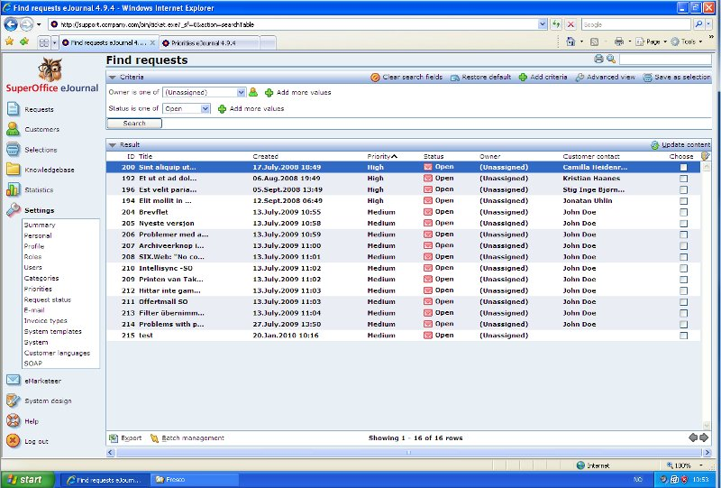

<properties date="2016-06-24"
/>

Requests as a queue

Working with requests as a queue
=============================================

This article discusses how to work with requests as a queue, according to their priority or deadline

When working with requests in a typical support environment, a central question is how to assign the requests. Under category settings, you can choose between various methods of delegation (pushing requests to users), or choosing to leave them "unassigned", essentially moving the responsibility of picking up the requests to the users. Using the unassigned delegation method will allow the team to work more like a call-center team, picking up the request (call) which have been waiting in the queue the longest amount of time. The advantage of this method is that you reduce the risk of requests getting "stuck" because they have been assigned to someone who is very busy (i.e. with another complicated request). The users should only pick requests from the queue (i.e. changing ownership from "unassigned" to themselves) when they have the capacity of handling them. The queue of unmanaged requests are the unassigned (and open) ones.

1. autolist
