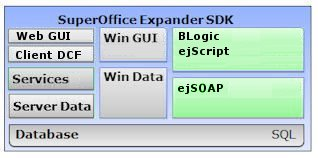

<properties date="2016-06-24"
SortOrder="1"
/>

 
Expander SDK:Customer Service API
=================================

Customer Service and Support (aka eJournal) has a several APIs.

* Business Logic - a screen designer that lets you build and extend the eJournal system.
* A scripting API is available for extending the basic eJournal site. Access to scripting functions requires a license.
* A SOAP API is available for external programs to read/write information. Access to the SOAP API requires a license.

Please explore what is available in this part of the SDK:

* [Business Logic: Screen designer, queries, scripts](Blogic/Blogic.md)
* [ejScript language reference](EJScript/EJScript.md)
* [ejScript event model](EJScript%20event%20model/EJScript%20event%20model.md)
* [Debugging hints](Debugging/Debugging.md)
* [Programming examples](Examples/Examples.md)
* [Programming Reports](Reports/Reports.md)
* [Using the SOAP API](SOAP/SOAP.md)
