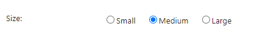

**Form elements** create user interaction through input fields.

* These elements may **not** contain children.
* These elements should be located in a [Form Page element](@blogic_form_page)

## Buttons

Depending on which behavior you want, you can either add button elements (single or row) or configure the form page.

### [Button](@blogic_button) element

```crmscript
button.title = "Click bait"
button.onClick = onclick="alert('Wow! You actually clicked it!');"
```

### [Button row](@blogic_button_row) element

```crmscript
buttons.0.name = ok
buttons.0.label = Ok
buttons.1.name = cancel
buttons.1.label = Cancel
buttons.length = 2
align = right
```

> [!NOTE]
> The name of each button (*ok* and *cancel* in this case) must be mapped to scripts in the **Buttons** tab.

### Configure the form page

**Add button in Simple values tab:**

```crmscript
HtmlElement formPage;

Map m;
m.insert("name", "superButton");
m.insert("label", "Pick me!");
m.insert("style", "StyleGreen");
m.insert("warning", "Are you sure?");

formPage.setFieldValue("addButton", m);
```

**Add button in creation script:**

This is useful when you need to set conditions for showing the button.

```crmscript
HtmlElement formPage;
if (ticketId > 0 && ticket.getValue("status") != "4" && getActiveUser().isAdministrator() && getCgiVariable("actionType").toInteger() == 2) {
  Map m;
  m.insert("name", "delete");
  m.insert("label", getLanguageVariable("delete"));
  m.insert("warning", getLanguageVariable("sureDelete"));
  m.insert("style", "red");
  formPage.setFieldValue("addButton", m);
}
```

> [!NOTE]
> Regardless of whether you use simple values or the creation script, the name of the button must be mapped to a script in the **Buttons** tab.

### Button actions

When the user clicks a button in an interactive screen (form), something should happen. You have to create a CRMScript to describe that something.

This example shows what happens when someone clicks **Cancel** in the **Edit ticket** screen.

```crmscript
String ticketId = getVariable("entryId");

User u;
u.load(getVariable("activeUser").toInteger());

Integer actionType = getCgiVariable("actionType").toInteger();

FHBitSet flags;
flags.set(u.getValue("flags").toInteger());

Bool newWindow = flags.getBitNo(11);


if (ticketId.toInteger() > 0) {
  if (newWindow && (actionType == 1 || actionType == 2)) {
    setVariable("url", "?action=doScreenDefinition&idString=ej_closeTicket&ticketId=" + ticketId);
  }
  else {
    setVariable("url", getProgram(1) + "?action=listTicketMessages&ticketId=" + ticketId);
  }
}
else if (getCgiVariable("custId").toInteger() > 0) {
  setVariable("url", getProgram(1) + "?action=viewCustomer&id=" + getCgiVariable("custId"));
}
else {
  setVariable("url", getProgram(1) + "?action=mainMenu");
}
```

## [Checkboxes](@blogic_checkbox)

A **checkbox** is an input element used to let a user select an option. It is shown as a square box that is ticked when activated.

For example, you might want the user to accept terms or opt in before submitting the form.

1. Add an element of type `checkbox` where you want it to appear.
2. Set simple value `label` and optionally `suffixLabel`.

```crmscript
label = Crazy
suffixLabel = I agree to use this experimental stuff
```


### Mark a checkbox

To mark a checkbox in a script, call `setValue()`:

```crmscript
HtmlElement t;
t.setValue("crazy", "1");
```

## [Radio button](@blogic_radiobuttons)

A **radio button** is an input element used to let the user select only 1 option from a predefined set. The options in the set are mutually exclusive.

1. Add an element of type `radiobuttons` where you want it to appear.
2. Set simple value `label` and then specify each option. Remember to set `buttons.length` accordingly.

For example, let's say we're picking t-shirt size:

```crmscript
label = Size
buttons.0.value = small
buttons.0.label = Small
buttons.1.value = medium
buttons.1.label = Medium
buttons.1.checked = true
buttons.1.value = large
buttons.1.label = Large
buttons.length = 3
```



Next, we're adding another option and changing which option is selected in the creation script:

```crmscript
HtmlElement formPage;
Map m;
m.insert("label", "Child");
m.insert("value", "child");
formPage.setFieldValue("addButton", m);

Map checked;
checked.insert("value", "child");
checked.insert("buttonValue", "1");

formPage.setFieldValue("setChecked", checked);
```

## Simple controls

* [Folder explorer](@blogic_tree_explorer)
* [Language menu](@blogic_language_menu): spell-checker for input fields
* [Text](@blogic_text): adds a single-line text input field
* [Text area](@blogic_textarea): adds an input field that can span several lines

## Drop-downs

* [List-box](@blogic_listbox): adds a custom drop-down list
* [MDO list](@blogic_mdolist): adds an MDO list, must specify which list you want to use
* [Related drop-downs](@blogic_related_dropdowns)

## Editors

* [CK editor](@blogic_ck_editor)
* [FCK editor](@blogic_fck_editor)
* HTML editor: **deprecated**

## Context-specific elements

These form elements are specific to some SuperOffice entities.

* [Address book](@blogic_address_book): organizes addresses in a tree view
* [Attachment](@blogic_attachment): adds an attachment field to the screen
* [Category membership](@blogic_category_membership): used to visualize (and change) which category a user belongs to
* [Contact and recipient](@blogic_contact_and_recipient): represent customers connected to a request
* [Edit entity menu](@blogic_edit_entity_menu)
* [Invoice rows](@blogic_invoice)
* [Message grid](@blogic_message_grid)
* [Recipients](@blogic_recipients)

## Select entity fields

There's a wide range of elements that add an input field to select an entity of a specific type. For example, [Select company](@blogic_select_company) and [Select sale](@blogic_select_sale).
