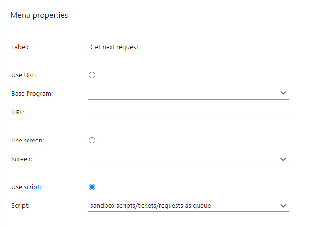

A **button script** is a CRMScript that is referenced by its **includeId** and will be run when the user clicks a custom button.

Setting it up is a simple 2-step process:

1. Write your script and save it on the **CRMScript** page in SuperOffice Admin client.
2. Add a button pointing to that script.

> [!NOTE]
> Button scripts will open a new browser window.

## Creating the script

1. Sign in to the SuperOffice admin client.
2. Open the **CRMScript** page.
3. Click **New script** and enter information. Don't forget the **include name**!
4. Add your code to the **Script** tab and click **OK**.

### Example: requests as queue

In a typical support environment, a central question is how to assign the requests. Using the **unassigned delegation method** will allow the team to work more like a call-center, picking up the request (call) that has been waiting in the queue the longest. This reduce the risk of requests getting "stuck".

You might want to differentiate on **priority**. Some requests are more urgent than others, and thus we want to make sure the team picks the highest priority requests first. Unfortunately, if the load is high, the team might never get to requests with medium or low priority

Another way of sorting by priority is using the **deadline** field on a requests. When a request is created, the deadline is set according to the request's priority.

Let's assume your priorities are set up as follows:

| Priority | Working hours      | Deadline |
|:---------|:-------------------|:---------|
| High     | Mon-Fri, 0800-1900 | 4 hour   |
| Medium   | Mon-Fri, 0800-1600 | 8 hour   |

Your queue might look like this:

* Request 1 created Monday at 13:00 with medium priority will get deadline Tuesday at 13:00.
* Request 2 created Monday at 13:00 with a high priority will get deadline Monday at 17:00.
* Request 3, created Tuesday at 12:00 with a high priority will get deadline Tuesday at 16:00.

Picking based on a deadline, request 1 will be picked before request 3, even if the latter has a higher priority.

Now, we can create a script that picks the most important request (open, unassigned) for a user (taking into account category membership) and assigns it to the current user. If no requests are available (empty queue), a simple message is displayed.

```crmscript
String userId = "ticket.category.(category_membership->category_id).user_id";
String activeUser = getVariable("activeUser");

SearchEngine se;
se.addFields( "ticket", "id,title,deadline" );
se.addCriteria( userId, "OperatorEquals",  activeUser, "OperatorAnd", 0 );
se.addCriteria( "ticket.owned_by", "OperatorEquals", "1", "OperatorAnd", 0 );
se.addCriteria( "ticket.status", "OperatorEquals", "1", "OperatorAnd", 0 );
se.addOrder( "ticket.deadline", true );

se.execute();
if (!se.eof()) {
  Ticket t;
  t.load(se.getField(0).toInteger());
  t.setValue("ownedBy",  activeUser);
  t.save();
  setVariable("url", getProgramTicket() + "&action=listTicket&ticketId=" + t.getValue("id"));
}
else {
 exitWithMessage("There are no more unassigned open requests in your categories");
}
```

Next, we'll make the script available as a button in the **View request** screen.

## Referencing the script

To reference your script, its **include ID must have been set**. Edit your script if this setting is missing before you continue.

Next, you construct the URL, which specifies to run bLogic, invoke the **doScript** action, and pass the include ID.

\<site>/\<custId>/CS/scripts/blogic.exe?action=doScript&includeId=\<myScript>

> [!TIP]
> Read more about [URL parameters](./url-parameters.md).

## Adding the button

To add the button, you must create an [extra menu](./extra-menus.md) in SuperOffice Service:

1. From the hamburger menu, select **System Design** and then select **Extra menus**.
2. Expand *Top menu*, point to one of the folders, and click **New menu**.
3. Set **Label** to what you want the button text to be (keep it short).
4. Select **Use script** and then select your CRMScript.
5. Optionally set other menu properties.
6. Click **OK**.

### Example (cont.)

Continuing our example, we'll label our button *Get next request* and select the CRMScript, here named *Requests as queue*.



After saving, the new button is available on the **View request** screen. Clicking the button will run the script and assign the next request according to our call-center model.


