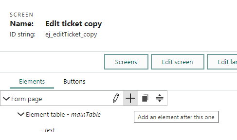

**Custom screens** are based on a set of [screen elements](../blogic-screen-elements/blogic-screen-elements.md) (controls) such as text, date, grid, and CRMScript.

**Screen properties** are a combination of settings and CRMScripts.

## Creating a custom screen

1. Sign in to SuperOffice Service.
2. From the hamburger menu, select **System Design** and then select **Screens**.
3. Click **New screen**.
4. Enter screen properties (name is mandatory) and click **OK**.
5. [Add elements](./add-screen-element.md).
6. Click **OK** to save your screen.
7. Toggle preview to test your current screen.
8. Set up a [screen chooser](../screen-choosers.md).

> [!TIP]
> You can set **hidden variables** to be saved when the screen is submitted so the next screen has access to them.

## Modifying an existing screen

The standard SuperOffice screens are locked and can't be edited. These defaults will be overwritten each time the application is upgraded.

To modify one of the built-in screens, you need to:

1. Create a copy of a screen.
2. Edit the copy.
3. Use a screen chooser to pick your copy instead of the default.

> [!CAUTION]
> You need to keep your copy up-to-date with new versions of the screen you copied.

### Copy a screen

1. Sign in to SuperOffice Service.

2. From the hamburger menu, select **System Design** and then select **Screens**.

3. Expand **System screens**.

4. Point to the screen you want to copy and then click **Copy screen**.
    * You new screen is added to the list. It's name is the name of the original screen with the word *copy* added to it.

### Edit copy of a screen

After you've created a copy of a system screen, you can edit the copy:

* Point to your copy and click **Edit screen**.

### Example

Let's say we want to display some text at the top of the **Edit request** screen. To do this, we can add a **view** element of type [`Info fields v2`](../blogic-screen-elements/info-fields-2.md).

1. While in edit mode, point to the main table and click **+** to add an element directly inside it.

2. Select type and give the element a name so that you can get a reference to it afterward in your script.

3. Click **Edit screen** and extend the loading script (after setFromCgi) to pull data into your new field.

4. Save and preview the screen.

## Settings

| Setting            | Description                                                                    |
|:-------------------|:-------------------------------------------------------------------------------|
| Folder             | Optional for organizing screens                                                |
| Name               | A descriptive name: mandatory Keep in mind that it becomes the heading on your screen |
| ID string          | A unique ID for the screen, referenced in URLs It's considered best practice to set it |
| Authentication key | Required when running a custom screen without being logged in as a user        |
| Warn on navigate   | Whether to give a warning when the user leaves a page with unsaved data (Bool) |
| Use auto-save      | Whether to turn on automatic save (Bool)                                       |

## Loading scripts

You can use scripts to precalculate variables from for example a form entry or CGI variables that the screen obtains via a URL.

| Script                    | Description                                                                   |
|:--------------------------|:------------------------------------------------------------------------------|
| before setFromCgi         | A script run before the screen elements are assigned their values             |
| after setFromCgi          | A script run after the screen elements are assigned their values              |
| run after everything else | A script run at the end, after code and scripts for any buttons have been run |

Read more about [screen events](../screen-events.md).
