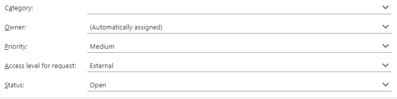
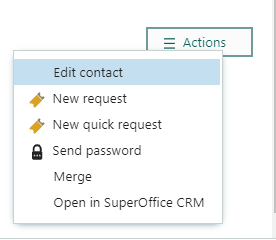
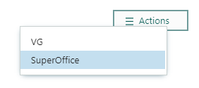
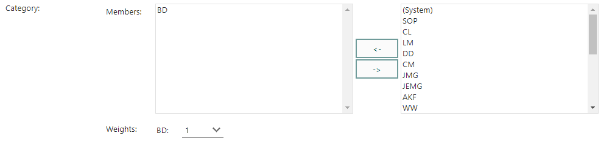
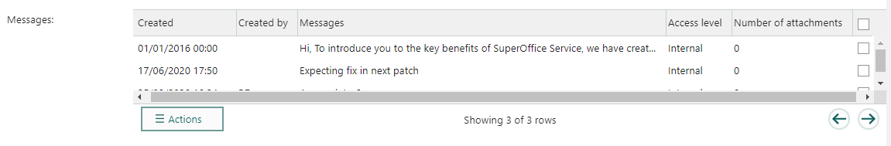
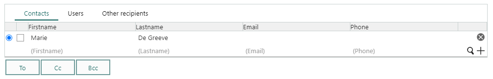
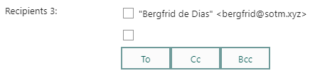
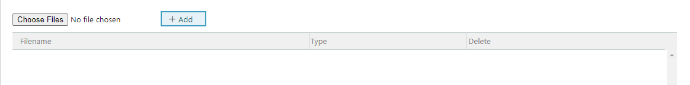

Some form elements are specific to SuperOffice entities.

## Select entity fields

There's a wide range of elements that add a drop-down to select an entity of a specific type. For example, [select company](../blogic-screen-elements/select-company.md) and [select sale](../blogic-screen-elements/select-sale.md).



## Edit entity menu element

Adds an [entity menu](../blogic-screen-elements/edit-entity-menu.md).

### Default menu for customer

**Simple values:**

```crmscript
entity = customer
entityMenu = customer
label = Entitymenu
```



### Custom menu

**Creation script:**

```crmscript
HtmlElement em;
Map m;

m.insert("label", "VG");
m.insert("iconUrl", "");
m.insert("url", "http://www.vg.no");
m.insert("target", "");
em.setFieldValue("addMenu", m);
m.clear();

m.insert("label", "DN");
m.insert("iconUrl", "");
m.insert("url", "http://www.dn.no");
m.insert("target", "");
em.setFieldValue("addAnchor", m);
m.clear();

m.insert("label", "SuperOffice");
m.insert("iconUrl", "");
m.insert("url", "https://www.superoffice.com");
m.insert("target", "");
em.setFieldValue("addMenu", m);
m.clear();
```



## Persons and organizations

**Selection drop-downs:**

* [Select agent](../blogic-screen-elements/select-agent.md)
* [Select company](../blogic-screen-elements/select-company.md)
* [Select contact business](../blogic-screen-elements/select-contact_business.md)
* [Select contact category](../blogic-screen-elements/select-contact_category.md)
* [Select contact](../blogic-screen-elements/select-contact.md) and [Select contacts](../blogic-screen-elements/select-contacts.md)
* [Select user](../blogic-screen-elements/select-user.md)

### Category membership element (for user)

Used to visualize (and change) [which category a user belongs to](../blogic-screen-elements/category_membership.md).

```crmscript
categoryId = 2
label = Category
noWeights = false
```



> [!TIP]
> Read more about [working with users](../CRMScript/working-with/persons-and-organizations/user.md).

## Follow-ups, dates, and time

**Selection drop-downs:**

* [Select appointment](../blogic-screen-elements/select-appointment.md)
* [Select date](../blogic-screen-elements/select-date.md)
* [Select datetime](../blogic-screen-elements/select-datetime.md)
* [Select time](../blogic-screen-elements/select-time.md)
* [Select timespan](../blogic-screen-elements/select-timespan.md)

## Requests

**Selection drop-downs:**

* [Select category](../blogic-screen-elements/select-category.md) (for ticket)
* [Select priority](../blogic-screen-elements/select-priority.md) (for ticket)
* [Select message](../blogic-screen-elements/select-message.md) (from ticket)
* [Select request status](../blogic-screen-elements/select-request_status.md)
* [Select FAQ](../blogic-screen-elements/select-faq.md)
* [Select reply template](../blogic-screen-elements/select-reply_template.md)
* [Select insert text](../blogic-screen-elements/select-insert_text.md)

### Message grid

A [message grid](../blogic-screen-elements/message_grid.md) displays the messages of a ticket in a grid. Each message has a check-box.

```crmscript
label = Messages
ticketId = 3
```



### Contact and recipient

Represent [customers connected to a request](../blogic-screen-elements/contact-and-recipient.md).

**Creation script to set the ticket ID dynamically:**

```crmscript
Map config = getScreenElementConfig(screenElementIndex);
config.insert("ticketId", getVariable("entryId"));

addHtmlElement(getScreenElementId(screenElementIndex), getScreenElementName(screenElementIndex),
  getScreenElementType(screenElementIndex), config);
```

**Creation script to override the default columns:**

This removes the pre-defined columns (noDefaultFields) and adds columns for first name, last name, email, and phone.

```crmscript
HtmlElement recipients = addHtmlElement(getScreenElementId(screenElementIndex),
  getScreenElementName(screenElementIndex),
  getScreenElementType(screenElementIndex),
  "ticketId = " + getCgiVariable("ticketId") + "\nlabel = Recipients\nnoDefaultFields = true\n");

Map colMap;

colMap.insert("displayField", "person.firstname");
colMap.insert("searchField", "person.firstname");
colMap.insert("operator", "OperatorBeginsWith");
colMap.insert("label", "Firstname");
recipients.setFieldValue("addColumn", colMap);

colMap.clear();
colMap.insert("displayField", "person.lastname");
colMap.insert("searchField", "person.lastname");
colMap.insert("operator", "OperatorBeginsWith");
colMap.insert("label", "Lastname");
recipients.setFieldValue("addColumn", colMap);
colMap.clear();

colMap.insert("displayField", "Email.email_address");
colMap.insert("searchField", "Email.email_address");
colMap.insert("operator", "OperatorBeginsWith");
colMap.insert("label", "Email");
recipients.setFieldValue("addColumn", colMap);
colMap.clear();

colMap.insert("displayField", "phone.phone");
colMap.insert("searchField", "phone.phone");
colMap.insert("operator", "OperatorBeginsWith");
colMap.insert("label", "Phone");
recipients.setFieldValue("addColumn", colMap)
```



### [Request status](../blogic-screen-elements/select-ticket-status.md) element

### [Recipients](../blogic-screen-elements/recipients.md) element

```crmscript
copyToAll = false
copyToCreatedBy = true
copyToCustomer = false
copyToEab = false
copyToOther = false
copyToOwner = true
copyToSelf = true
label = Recipients 3
ticketId = 1
```



### [Address book](../blogic-screen-elements/address-book.md) element

Organizes addresses in a tree view

### Attachment element

Adds an [attachment field](../blogic-screen-elements/attachment.md) to the screen.

```crmscript
label = Attachments
multiple = true
noHardDelete = true
```



## Sales and projects

**Selection drop-downs:**

* [Select sale](../blogic-screen-elements/select-sale.md)
* [Select project](../blogic-screen-elements/select-project.md)

### [Invoice rows](../blogic-screen-elements/invoice.md) element

## Security and database

**Selection drop-downs:**

* [Select slevel](../blogic-screen-elements/select-slevel.md)
* [Select CRM selection](../blogic-screen-elements/select-crm_selection.md)
* [Select extra field](../blogic-screen-elements/select-extra_field.md)
* [Select table](../blogic-screen-elements/select-table.md)
* [Select relation](../blogic-screen-elements/select-relation.md)
* [Select relations](../blogic-screen-elements/select-multiple-relations.md)
