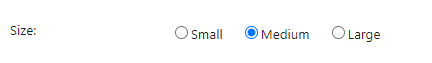
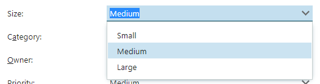
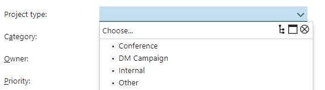
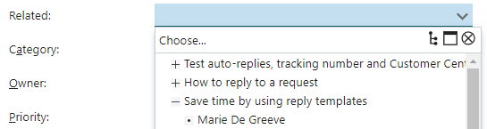
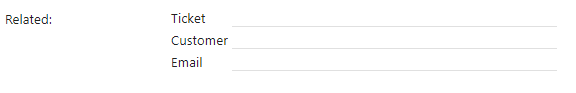
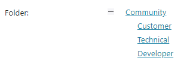
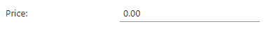
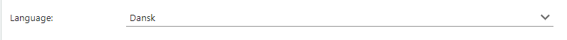
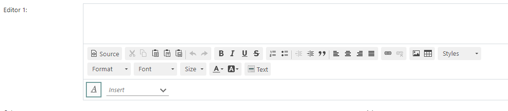

**Form elements** create user interaction through input fields.

* These elements may **not** contain children.
* These elements should be located in a [Form Page element](../blogic-screen-elements/form-page.md)

This page covers the **basic** element types. [Entity specific form elements](./form-elements-per-entity.md) are covered separately.

## Buttons

Depending on which behavior you want, you can either add button elements (single or row) or configure the form page.

### Button element

The [button](../blogic-screen-elements/button.md) element adds a single button.

```crmscript
button.title = "Click bait"
button.onClick = onclick="alert('Wow! You actually clicked it!');"
```

### Button row element

The [button row](../blogic-screen-elements/button-row.md) element adds multiple buttons.

```crmscript
buttons.0.name = ok
buttons.0.label = Ok
buttons.1.name = cancel
buttons.1.label = Cancel
buttons.length = 2
align = right
```

> [!NOTE]
> The name of each button (*ok* and *cancel* in this case) must be mapped to scripts in the **Buttons** tab.

### Configure the form page

**Add button in Simple values tab:**

```crmscript
HtmlElement formPage;

Map m;
m.insert("name", "superButton");
m.insert("label", "Pick me!");
m.insert("style", "StyleGreen");
m.insert("warning", "Are you sure?");

formPage.setFieldValue("addButton", m);
```

**Add button in creation script:**

This is useful when you need to set conditions for showing the button.

```crmscript
HtmlElement formPage;
if (ticketId > 0 && ticket.getValue("status") != "4" && getActiveUser().isAdministrator() && getCgiVariable("actionType").toInteger() == 2) {
  Map m;
  m.insert("name", "delete");
  m.insert("label", getLanguageVariable("delete"));
  m.insert("warning", getLanguageVariable("sureDelete"));
  m.insert("style", "red");
  formPage.setFieldValue("addButton", m);
}
```

> [!NOTE]
> Regardless of whether you use simple values or the creation script, the name of the button must be mapped to a script in the **Buttons** tab.

### Button actions

When the user clicks a button in an interactive screen (form), something should happen. You have to create a CRMScript to describe that something.

This example shows what happens when someone clicks **Cancel** in the **Edit ticket** screen.

```crmscript
String ticketId = getVariable("entryId");

User u;
u.load(getVariable("activeUser").toInteger());

Integer actionType = getCgiVariable("actionType").toInteger();

FHBitSet flags;
flags.set(u.getValue("flags").toInteger());

Bool newWindow = flags.getBitNo(11);


if (ticketId.toInteger() > 0) {
  if (newWindow && (actionType == 1 || actionType == 2)) {
    setVariable("url", "?action=doScreenDefinition&idString=ej_closeTicket&ticketId=" + ticketId);
  }
  else {
    setVariable("url", getProgram(1) + "?action=listTicketMessages&ticketId=" + ticketId);
  }
}
else if (getCgiVariable("custId").toInteger() > 0) {
  setVariable("url", getProgram(1) + "?action=viewCustomer&id=" + getCgiVariable("custId"));
}
else {
  setVariable("url", getProgram(1) + "?action=mainMenu");
}
```

## Checkboxes

A [checkbox](../blogic-screen-elements/checkbox.md) is an input element used to let a user select an option. It is shown as a square box that is ticked when activated.

For example, you might want the user to accept terms or opt in before submitting the form.

1. Add an element of type **checkbox** where you want it to appear.
2. Set simple value `label` and optionally `suffixLabel`.

```crmscript
label = Crazy
suffixLabel = I agree to use this experimental stuff
```


### Mark a checkbox

To mark a checkbox in a script, call `setValue()`:

```crmscript
HtmlElement t;
t.setValue("crazy", "1");
```

## Radio buttons

A [radio button](../blogic-screen-elements/radio-buttons.md) is an input element used to let the user select only 1 option from a predefined set. The options in the set are mutually exclusive.

1. Add an element of type **radiobuttons** where you want it to appear.
2. Set simple value `label` and then specify each option. Remember to set `buttons.length` accordingly.

For example, let's say we're picking t-shirt size:

```crmscript
label = Size
buttons.0.value = small
buttons.0.label = Small
buttons.1.value = medium
buttons.1.label = Medium
buttons.1.checked = true
buttons.2.value = large
buttons.2.label = Large
buttons.length = 3
```



Next, we're adding another option and changing which option is selected in the creation script:

```crmscript
HtmlElement formPage;
Map m;
m.insert("label", "Child");
m.insert("value", "child");
formPage.setFieldValue("addButton", m);

Map checked;
checked.insert("value", "child");
checked.insert("buttonValue", "1");

formPage.setFieldValue("setChecked", checked);
```

## Drop-downs

A **drop-down** is an input element used to let the user select exactly 1 option from a list.

### List-box element

To add a [custom drop-down menu](../blogic-screen-elements/list-box.md):

1. Add an element of type **list box** where you want it to appear.
2. Set simple value `label` and then specify each option. Remember to set `options.length` accordingly.

```crmscript
label = Size
options.0.value = small
options.0.name = Small
options.1.value = medium
options.1.name = Medium
options.1.selected = true
options.2.value = large
options.2.name = Large
options.length = 3
```



Next, we're replacing an option in the creation script:

```crmscript
HtmlElement formPage;
Map new;
new.insert("name", "Child");
new.insert("value", "child");
formPage.setFieldValue("add", new);

Map old;
old.insert("value", "large");
formPage.setFieldValue("remove", old);
```

### MDO list element

Adds a [drop-down menu with values from an MDO list](../blogic-screen-elements/mdo-list.md). You must specify which list you want to use.

```crmscript
label = Project type
list = projecttype
```



> [!TIP]
> Use **NSMDOAgent** to get an overview of all available MDO lists. If you want it alphabetical, use a Map. If not, simply print the *name* in the `foreach` loop.

```crmscript!
NSMDOAgent agent;

String[] listNames = agent.GetListNames();

Map sortedListNames;

foreach(String name in listNames) {
  sortedListNames.insert(name, "");
}

sortedListNames.first();

while (!sortedListNames.eof()) {
  printLine(sortedListNames.getKey());
  sortedListNames.next();
}
```

### Related drop-downs element

Adds a [custom drop-down menu](../blogic-screen-elements/related-drop-downs.md) where the options depend on the value selected in another drop-down.

In **tree mode**, you get 1 drop-down with a multi-level list.



In **list-mode**, you get n drop-downs, either side-by-side or in a vertical list. Each level has its own label.



#### Example

Let's assume we're creating 3 drop-downs:

* request
* customer
* the customer's email

Because the IDs of a request and a customer might be identical, we add a prefix c to customer IDs.

**Simple values:**

```crmscript
label = Related
notEmptyDropdown = 0
selectFromTree = true
```

**Creation script of element:**

```crmscript
HtmlElement e;
Map m;

SearchEngine se;
se.addFields("ticket","id,title");
se.addCriteria("ticket.status", "OperatorLt", "4", "OperatorAnd", 0);
se.addOrder("ticket.id", true);

for (se.execute(); !se.eof(); se.next()) {
  m.insert("id", se.getField(0));
  m.insert("value",  se.getField(1));
  m.insert("isFolder", "0");
  e.setFieldValue("addNode", m);
}

m.clear();

SearchEngine cust;
cust.addFields("ticket_customers","ticket_id,customer_id.display_name,customer_id");
cust.addCriteria("ticket_customers.ticket_id.status", "OperatorLt", "4", "OperatorAnd", 0);

for (cust.execute(); !cust.eof(); cust.next()) {
  m.insert("id", "c" + cust.getField(2));
  m.insert("parent", cust.getField(0));
  m.insert("value",  cust.getField(1));
  m.insert("isFolder", "0");
  e.setFieldValue("addNode", m);
}

m.clear();

SearchEngine email;
email.addFields("cust_email","cust_id,email");

for (email.execute(); !email.eof(); email.next()) {
  m.insert("id", email.getField(1));
  m.insert("parent", "c" + email.getField(0));
  m.insert("value",  email.getField(1));
  m.insert("isFolder", "0");
  e.setFieldValue("addNode", m);
}
```

## Folder explorer (tree explorer)

A [folder explorer](../blogic-screen-elements/tree-explorer.md) sets up information in an expandable tree. Think of it as a manually crafted multi-level menu. You build the tree by adding nodes and setting parent ID to the direct ancestor - except for the root node.

1. Add an element of type **folder explorer** where you want it to appear.
2. Set simple value `label`.
3. In the creation script, start by setting up the root node.
4. Next, add level-2 children with `parent.id` set to the ID you chose for the root.
5. Continue adding childe nodes at increasingly lower levels.

**Simple values:**

```crmscript
label = Folder
```

**Creation script:**

```crmscript
HtmlElement folder;

Map m;

m.insert("id", "1");
m.insert("onclick", "alert('test');");
m.insert("href", "https://community.superoffice.com/en/");
m.insert("name", "Community");
m.insert("tooltip", "Super tooltip");
m.insert("target", "_blank");
m.insert("order", "desc");
m.insert("leaf", "true");
m.insert("icon", "false");

Map link;
link.insert("href", "https://www.superoffice.com//");
link.insert("target", "_blank");
link.insert("tooltip", "SuperOffice");

folder.setFieldValue("addEntry", m);
folder.setFieldValue("addLink", link);

m.clear();

m.insert("id", "2");
m.insert("href", "https://community.superoffice.com/en/customer/");
m.insert("name", "Customer");
m.insert("target", "_blank");
m.insert("leaf", "true");
m.insert("parent.id", "1");

folder.setFieldValue("addEntry", m);
m.clear();

m.insert("id", "3");
m.insert("href", "https://community.superoffice.com/en/technical/");
m.insert("name", "Technical");
m.insert("target", "_blank");
m.insert("leaf", "true");
m.insert("parent.id", "1");

folder.setFieldValue("addEntry", m);
m.clear();

m.insert("id", "4");
m.insert("href", "https://community.superoffice.com/en/developer/");
m.insert("name", "Developer");
m.insert("target", "_blank");
m.insert("leaf", "true");
m.insert("parent.id", "1");

folder.setFieldValue("addEntry", m);

m.clear();
m.insert("sortbyName", "true");
m.insert("expandId", "1");
m.insert("pruneEmptyFolders", "true");
folder.setFieldValue("set", m);
```



## Text

For alphanumeric input, you can choose either a single-line field, a multi-line field (area), or an editor.

### Text element

[Text](../blogic-screen-elements/text.md) restricts you to 1 line, but allows you to place restrictions on size and expected contents.

This example sets up a field that requires a decimal number (float):

```crmscript
label = Price
notEmpty = true
maxLength = 20
size = 10
placeholder = 0.00
isNumber = true
precision = 2
minValue = 0
maxValue = 9 999 999
noRangeCheck = false
```



### Text area element

For [multi-line input fields](../blogic-screen-elements/textarea.md), you need to specify the size of the area. You can't place restrictions on expected content as you do for *Text* elements.

```crmscript
label = Comments
cols = 40
rows = 5
notEmpty = false
```

### Language menu element

Displays a [drop-down with different languages](../blogic-screen-elements/language-menu.md). Used by the spell-checker for input fields.



### CK editor and FCK editor

These editor elements let users create HTML-formatted messages. They can insert images, tables, paragraphs, and so on.

> [!NOTE]
> The [CK editor](../blogic-screen-elements/ck-editor.md) is newer and what you should aim to use.

The editor must be inside an `Element table`. It is often placed directly before a `ContactAndRecipient` element, but it doesn't have to be.

```crmscript
actionType = 0
CKConfig.toolbarStartupExpanded = true
label = Editor 1
showInsertText = true
valueId = true
verticalSpace = rest
```


