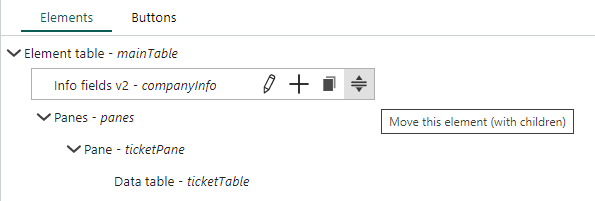

**Group elements** are containers - they create a hierarchy of elements and determine the layout of the screen.
These elements may contain children, unlike the simpler view and form elements, which may not.

The layout elements are:

* Element group (Fieldset)
* Panes and Pane
* Panel
* Element table
* Element table v2
* Form page

> [!TIP]
> Use one of the element tables to put elements side-by-side.

## Calculating available space

The available space for each element is calculated each time a user opens a custom screen.

1. The system calls a method on the **outermost element** (OE) stating the total space available in the browser.

2. OE reserves some space for itself, and then tells its children how much they have available.

3. Each child reserves some space for itself. AND if a child is a container, it will tell its children how much they can use.

4. The calculation continues until all elements in the hierarchy know how much space they can use.

## Nesting

How you **nest** elements determines the structure of your screen. It is crucial that you place **GroupEnd** elements after the last child in a container. A missing or misplaced `GroupEnd` will mess up your hierarchy.

```html
<ElementTable>
  <Panes>
    <Pane>
      <ElementTable>
        <CKEditor>
        <ContactAndRecipient>
      <GroupEnd>
    <GroupEnd>
  <GroupEnd>
<GroupEnd>
```

When viewing the definition of a screen, you can hover an element in the tree and:

* Add a new element directly after it
* Duplicate an element
* Move an element



## Element group (Fieldset)

An [element group](../blogic-screen-elements/fieldset.md) creates a small inset frame around its children in the browser.

Use it to group related elements in a form.

## Panes and Pane

A [Pane](../blogic-screen-elements/pane.md) creates a tab. The [`Panes` element](../blogic-screen-elements/blogic-panes.md) is a container for 1 or more `Pane` elements. A pane must be placed directly inside `Panes`.

You can set the title of individual tabs.

> [!NOTE]
> Pane **doesn't handle the layout of multiple children**. To place more than 1 view or form element on a tab, wrap them in another container such as Element table.

### Example config

**Panes:**

```crmscript
renderMode = visited
verticalSpace = rest
```

**Pane:**

```crmscript
title = %lang("lang_ticket_viewCompany_tickets")%
```

## Panel

A [Panel](../blogic-screen-elements/panel.md) adds a white background to the screen. Also known as the **white sheet**.

Use panels to **improve readability**. Without a parent Panel or Pane, screen elements are placed directly on the default gray background.

> [!NOTE]
> Panel **doesn't work with multiple children**. To place more than 1 element on a white background, wrap them in another container such as **Element table**.

## Element table

[Element table](../blogic-screen-elements/element-table.md) is one of the most central layout controls. It places its children in a 1-row grid.

It does a double-pass over its children, figuring out how much space they require and allows the remaining to be dynamically resized to the remaining space.

> [!NOTE]
> `Element table` has some overhead when resizing complex screens. Consider using `Element table v2` for layout out large sections.

### Vertical space

Setting this to *rest* for any immediate child will stretch the element out to the maximum available vertical space. If multiple child elements have verticalSpace=rest, the remaining space will be divided equally.

Use the `verticalSpace` setting for example if you have a `Text area` or editor in a screen and want it to become as large as possible, occupying all the available space.

> [!TIP]
> Use sizeAttributes_ to control the size of each child that supports dynamic resizing.

## Element table v2

[Element table v2](../blogic-screen-elements/element-table-2.md) is an improved version of `Element table` that lets you lay out elements in a 2-dimensional grid.

It allocates how much space each child gets. It **does not adjust** depending on how much space its children require.

Use this for example to create multiple areas in a dashboard.

> [!TIP]
> You can nest multiple `Element table v2`.

### Rows and columns

You should set the initial number of rows and columns. It is more important to get columns right. The number of rows will expand dynamically if there are more children than the initial space.

You can then set the size of individual rows and columns. For example:

```crmscript
row.0.size = 25%
column.0.size = 300px
```

> [!NOTE]
> You must specify row.length and column.length before you can start using the index notation.

You can also set `layout.colspan` and `layout.rowspan` on the **child** elements.

## Form page

A [Form page](../blogic-screen-elements/form-page.md) is a standard root frame used in a lot of screens.

Use it to add a button to a form.
