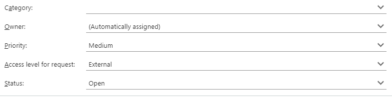
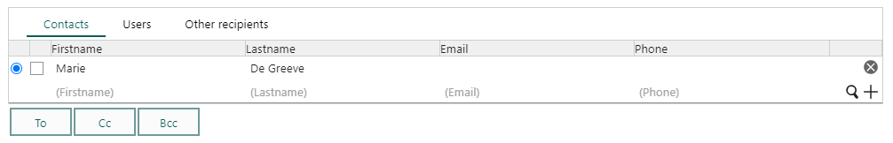
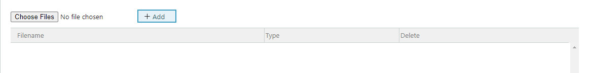

Some form elements are specific to SuperOffice entities.

## Select entity fields

There's a wide range of elements that add a drop-down to select an entity of a specific type. For example, ./blogic-screen-elements/select-company and ./blogic-screen-elements/select-sale.



## [Edit entity menu](./blogic-screen-elements/edit-entity-menu.md)

### Default menu for customer

**Simple values:**

```crmscript
entity = customer
entityMenu = customer
label = Entitymenu
```


### Custom menu

**Creation script:**

```crmscript
HtmlElement em;
Map m;

m.insert("label", "VG");
m.insert("iconUrl", "");
m.insert("url", "http://www.vg.no");
m.insert("target", "");
em.setFieldValue("addMenu", m);
m.clear();

m.insert("label", "DN");
m.insert("iconUrl", "");
m.insert("url", "http://www.dn.no");
m.insert("target", "");
em.setFieldValue("addAnchor", m);
m.clear();

m.insert("label", "SuperOffice");
m.insert("iconUrl", "");
m.insert("url", "https://www.superoffice.com");
m.insert("target", "");
em.setFieldValue("addMenu", m);
m.clear();
```


## Persons and organizations

**Selection drop-downs:**

* See ./blogic-screen-elements/select-agent
* See ./blogic-screen-elements/select-company
* See ./blogic-screen-elements/select-contact_business
* See ./blogic-screen-elements/select-contact_category
* See ./blogic-screen-elements/select-contact and ./blogic-screen-elements/select-contacts
* See ./blogic-screen-elements/select-user

### [Category membership](./blogic-screen-elements/category_membership.md) (for user)

Used to visualize (and change) which category a user belongs to.

```crmscript
categoryId = 2
label = Category
noWeights = false
```


> [!TIP]
> Read more about [working with users](../CRMScript\working-with\persons-and-organizations/user.md).

## Follow-ups, dates, and time

**Selection drop-downs:**

* ./blogic-screen-elements/select-appointment
* ./blogic-screen-elements/select-date
* ./blogic-screen-elements/select-datetime
* ./blogic-screen-elements/select-time
* ./blogic-screen-elements/select-timespan

## Requests

**Selection drop-downs:**

* ./blogic-screen-elements/select-category (for ticket)
* ./blogic-screen-elements/select-priority (for ticket)
* ./blogic-screen-elements/select-message (from ticket)
* ./blogic-screen-elements/select-request_status
* ./blogic-screen-elements/select-faq
* ./blogic-screen-elements/select-reply_template
* ./blogic-screen-elements/select-insert_text

### [Message grid](./blogic-screen-elements/message_grid.md)

Displays the messages of a ticket in a grid. Each message has a check-box.

```crmscript
label = Messages
ticketId = 3
```


### [Contact and recipient](./blogic-screen-elements/contact-and-recipient.md)

Represent customers connected to a request.

**Creation script to set the ticket ID dynamically:**

```crmscript
Map config = getScreenElementConfig(screenElementIndex);
config.insert("ticketId", getVariable("entryId"));

addHtmlElement(getScreenElementId(screenElementIndex), getScreenElementName(screenElementIndex),
  getScreenElementType(screenElementIndex), config);
```

**Creation script to override the default columns:**

This removes the pre-defined columns (noDefaultFields) and adds columns for first name, last name, email, and phone.

```crmscript
HtmlElement recipients = addHtmlElement(getScreenElementId(screenElementIndex),
  getScreenElementName(screenElementIndex),
  getScreenElementType(screenElementIndex),
  "ticketId = " + getCgiVariable("ticketId") + "\nlabel = Recipients\nnoDefaultFields = true\n");

Map colMap;

colMap.insert("displayField", "person.firstname");
colMap.insert("searchField", "person.firstname");
colMap.insert("operator", "OperatorBeginsWith");
colMap.insert("label", "Firstname");
recipients.setFieldValue("addColumn", colMap);

colMap.clear();
colMap.insert("displayField", "person.lastname");
colMap.insert("searchField", "person.lastname");
colMap.insert("operator", "OperatorBeginsWith");
colMap.insert("label", "Lastname");
recipients.setFieldValue("addColumn", colMap);
colMap.clear();

colMap.insert("displayField", "Email.email_address");
colMap.insert("searchField", "Email.email_address");
colMap.insert("operator", "OperatorBeginsWith");
colMap.insert("label", "Email");
recipients.setFieldValue("addColumn", colMap);
colMap.clear();

colMap.insert("displayField", "phone.phone");
colMap.insert("searchField", "phone.phone");
colMap.insert("operator", "OperatorBeginsWith");
colMap.insert("label", "Phone");
recipients.setFieldValue("addColumn", colMap)
```



### [Request status](./blogic-screen-elements/select-ticket-status.md)

### [Recipients](./blogic-screen-elements/recipients.md)

```crmscript
copyToAll = false
copyToCreatedBy = true
copyToCustomer = false
copyToEab = false
copyToOther = false
copyToOwner = true
copyToSelf = true
label = Recipients 3
ticketId = 1
```


### [Address book](./blogic-screen-elements/address-book.md)

Organizes addresses in a tree view

### [Attachment](./blogic-screen-elements/attachment.md)

Adds an attachment field to the screen.

```crmscript
label = Attachments
multiple = true
noHardDelete = true
```



## Sales and projects

**Selection drop-downs:**

* ./blogic-screen-elements/select-sale
* ./blogic-screen-elements/select-project

### [Invoice rows](./blogic-screen-elements/invoice.md)

## Security and database

**Selection drop-downs:**

* ./blogic-screen-elements/select-slevel
* ./blogic-screen-elements/select-crm_selection
* ./blogic-screen-elements/select-extra_field
* ./blogic-screen-elements/select-table
* ./blogic-screen-elements/select-relation
* ./blogic-screen-elements/select-multiple relations
