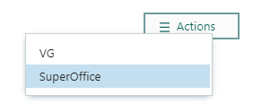
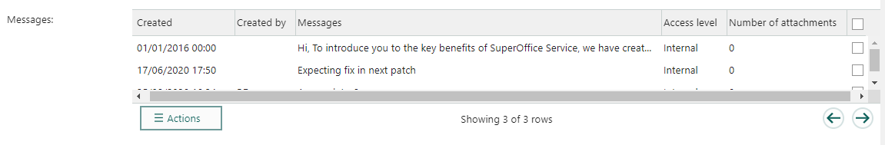
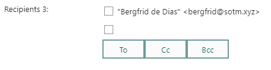

Some form elements are specific to SuperOffice entities.

## Select entity fields

There's a wide range of elements that add a drop-down to select an entity of a specific type. For example, [Select company](@blogic_select_company) and [Select sale](@blogic_select_sale).


## [Edit entity menu](@blogic_edit_entity_menu)

### Default menu for customer

**Simple values:**

```crmscript
entity = customer
entityMenu = customer
label = Entitymenu
```


### Custom menu

**Creation script:**

```crmscript
HtmlElement em;
Map m;

m.insert("label", "VG");
m.insert("iconUrl", "");
m.insert("url", "http://www.vg.no");
m.insert("target", "");
em.setFieldValue("addMenu", m);
m.clear();

m.insert("label", "DN");
m.insert("iconUrl", "");
m.insert("url", "http://www.dn.no");
m.insert("target", "");
em.setFieldValue("addAnchor", m);
m.clear();

m.insert("label", "SuperOffice");
m.insert("iconUrl", "");
m.insert("url", "https://www.superoffice.com");
m.insert("target", "");
em.setFieldValue("addMenu", m);
m.clear();
```



## Persons and organizations

**Selection drop-downs:**

* @blogic_select_agent
* @blogic_select_company
* @blogic_select_contact_business
* @blogic_select_contact_category
* @blogic_select_contact and @blogic_select_contacts
* @blogic_select_user

### [Category membership](@blogic_category_membership) (for user)

Used to visualize (and change) which category a user belongs to.

```crmscript
categoryId = 2
label = Category
noWeights = false
```


> [!TIP]
> Read more about [working with users](@crmscript-class-user).

## Follow-ups, dates, and time

**Selection drop-downs:**

* @blogic_select_appointment
* @blogic_select_date
* @blogic_select_datetime
* @blogic_select_time
* @blogic_select_timespan

## Requests

**Selection drop-downs:**

* @blogic_select_category (for ticket)
* @blogic_select_priority (for ticket)
* @blogic_select_message (from ticket)
* @blogic_select_request_status
* @blogic_select_faq
* @blogic_select_reply_template
* @blogic_select_insert_text

### [Message grid](@blogic_message_grid)

Displays the messages of a ticket in a grid. Each message has a check-box.

```crmscript
label = Messages
ticketId = 3
```



### [Contact and recipient](@blogic_contact_and_recipient)

Represent customers connected to a request.

**Creation script to set the ticket ID dynamically:**

```crmscript
Map config = getScreenElementConfig(screenElementIndex);
config.insert("ticketId", getVariable("entryId"));

addHtmlElement(getScreenElementId(screenElementIndex), getScreenElementName(screenElementIndex),
  getScreenElementType(screenElementIndex), config);
```

**Creation script to override the default columns:**

This removes the pre-defined columns (noDefaultFields) and adds columns for first name, last name, email, and phone.

```crmscript
HtmlElement recipients = addHtmlElement(getScreenElementId(screenElementIndex),
  getScreenElementName(screenElementIndex),
  getScreenElementType(screenElementIndex),
  "ticketId = " + getCgiVariable("ticketId") + "\nlabel = Recipients\nnoDefaultFields = true\n");

Map colMap;

colMap.insert("displayField", "person.firstname");
colMap.insert("searchField", "person.firstname");
colMap.insert("operator", "OperatorBeginsWith");
colMap.insert("label", "Firstname");
recipients.setFieldValue("addColumn", colMap);

colMap.clear();
colMap.insert("displayField", "person.lastname");
colMap.insert("searchField", "person.lastname");
colMap.insert("operator", "OperatorBeginsWith");
colMap.insert("label", "Lastname");
recipients.setFieldValue("addColumn", colMap);
colMap.clear();

colMap.insert("displayField", "Email.email_address");
colMap.insert("searchField", "Email.email_address");
colMap.insert("operator", "OperatorBeginsWith");
colMap.insert("label", "Email");
recipients.setFieldValue("addColumn", colMap);
colMap.clear();

colMap.insert("displayField", "phone.phone");
colMap.insert("searchField", "phone.phone");
colMap.insert("operator", "OperatorBeginsWith");
colMap.insert("label", "Phone");
recipients.setFieldValue("addColumn", colMap)
```


### [Request status](@blogic_select_ticket_status)

### [Recipients](@blogic_recipients)

```crmscript
copyToAll = false
copyToCreatedBy = true
copyToCustomer = false
copyToEab = false
copyToOther = false
copyToOwner = true
copyToSelf = true
label = Recipients 3
ticketId = 1
```



### [Address book](@blogic_address_book)

Organizes addresses in a tree view

### [Attachment](@blogic_attachment)

Adds an attachment field to the screen.

```crmscript
label = Attachments
multiple = true
noHardDelete = true
```


## Sales and projects

**Selection drop-downs:**

* @blogic_select_sale
* @blogic_select_project

### [Invoice rows](@blogic_invoice)

## Security and database

**Selection drop-downs:**

* @blogic_select_slevel
* @blogic_select_crm_selection
* @blogic_select_extra_field
* @blogic_select_table
* @blogic_select_relation
* @blogic_select_multiple relations
