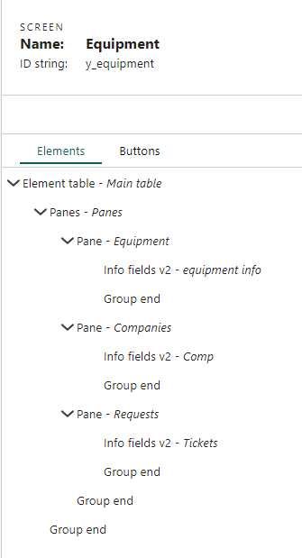

In this tutorial, we'll create an extra table in the SuperOffice database to organize equipment units (inventory) and relate them to requests and companies.
Then we'll create a custom screen in SuperOffice Service and finally make the table available as a web panel in Sales.

**View equipment:**


**Selecting company on equipment:**


> [!NOTE]
> This requires a valid SuperOffice Expander Services license.

## Step 1: create the table

**Name:** Equipment

**Database table:** y_equipment

**Fields:**

| Name         | Database field | Type         | Other settings         | Description                                               |
|:-------------|:---------------|:-------------|:-----------------------|:----------------------------------------------------------|
| Label        | x_label        | Text (short) | Cannot be empty<br/>Show in table<br/>View in rel. choosers | A label for the unit |
| Acquired     | x_acquired     | Date         | Show in table          | When the unit was acquired                                |
| Disposed     | x_disposed     | Date         | Show in table          | When (if ever) the unit was disposed                      |
| Memory       | x_memory       | Text (short) | Show in table          | Amount of memory                                          |
| Disk         | x_disk         | Text (short) | Show in table          | Amount of disk space                                      |
| Manufacturer | x_manufacturer | Text (short) | Show in table<br/>Choose values from list      | The manufacturer (drop-down)      |

1. Sign in to SuperOffice Service and open the **Tables** screen.
2. Click **New table**.
3. Set table properties. Then click **OK** to save.
4. Add fields to your new table. For each field:
    1. Point to the *Equipment* table and click **New field**.
    2. Select a type for the new field and click **OK**.
    3. Set field properties.
    4. Click **OK** to save the new field.
5. Click the table link to get to the Edit table screen.
6. Set *Label* as the **Sort order** and **Name field**. Then click **OK**.
7. Click **Restart NetServer**.

> [!TIP]
> You can find detailed instructions and conventions in the [database customization](../CRMScript/advanced/custom-database/extra-tables.md) section.

**Table properties:**


**Element properties:**


**Choose values from list:**


## Step2: relate equipment to requests and company

Next, we want to connect requests to equipment, so that we can easily track our request history for a certain equipment unit.

When relating tables, always consider the direction of a many-to-1 relationship. This determines which table you add the foreign key (FK) to.

### Requests

Because we want to have many requests related to 1 equipment unit, we'll create the relational field on the request table.
We also want to register all equipment owned by a company. This is the opposite direction (many equipment units for one company), so we'll addd the FK to the Equipment table.

1. Open the **Tables** screen.
2. Point to the *Requests* table and click **New field**.
3. Select type *Extra table relation* and click **OK**.
4. Set element properties and click **OK**.
5. Click **Restart NetServer**.


### Company

We also want to register all equipment owned by a company. This is the opposite direction (many equipment units for one company), so we'll addd the FK to the Equipment table.

1. Open the **Tables** screen.
2. Point to the *Equipment* table and click **New field**.
3. Select type *Company relation* and click **OK**.
4. Set element properties and click **OK**.
5. Click **Restart NetServer**.


### Fields

| Name      | Database field | Type                 | Add to table | Other settings         |
|:----------|:---------------|:---------------------|:-------------|:-----------------------|
| Equipment | x_equipment    | Extra table relation | Requests     | Enter *Requests* in **Header for list**<br/>Select your Equipment table under **Target table** |
| Company   | x_company      | Company relation     | Equipment    | Enter *Equipment* in **Header for list**<br/>Select **Show in table** |

## Step 3: add default Equipment screen to the Service navigator

We can add direct access to our table in the navigator (main menu) in Service.

1. Open the **CRMScript** page and select the **Triggers** tab.
2. Click **New trigger(script)**.
3. Type `main` in the search field and then select the **Main menu** trigger.
4. Copy and add the following script code and save the trigger.
5. Activate the trigger
6. Refresh your browser to make sure the new menu is loaded.

```crmscript
MainMenu menu = getMainMenu();
menu.addGroup("Equipment", "/graphics/picture.png", 1);
menu.addItem("List equipment", getProgram(1) + "&action=listExtraTable&extraTable=y_equipment", 1, 0);
menu.addItem("New unit", getProgram(1) + "&action=editExtraTableEntry&extraTable=y_equipment", 1, 1);
```


> [!TIP]
> Read more about the [main menu](./mainmenu.md).

## Step 4 (optional): create a custom screen

Rather than using the default generated Equipment screen, we can design our own. Here, we'll create 3 elements, each in its own pane.

When you're done, the tree should look like this:



1. Open the **Screens** page and click **New screen**.
2. Enter screen properties (name = Equipment) and click **OK**.
3. Add elements to your new screen. For each element:
    1. Click **New element**.
    2. Select the element type and enter a name.
    3. Copy the corresponding config into the **Simple values** tab.
    4. Click **Apply**. Then click **OK**.
4. Toggle preview to test your current screen.
5. Set up a [screen chooser](./screen-choosers.md).


### Elements

| Name      | Type           | Description                       |
|:----------|:---------------|:----------------------------------|
| Equipment | Pane           | Wrapper for equipment info        |
| Info      | Info fields v2 | Displays info about the equipment |
| Companies | Pane           | Wrapper for company info          |
| Company   | Info fields v2 | Displays info about the equipment |
| Requests  | Pane           | Wrapper for ticket info           |
| Tickets   | Data table     | Displays info about the requests  |

**Pane - simple values:**

```crmscript
renderMode = visited
verticalSpace = rest
title =
```

Set the title for each pane identical to the element name.

**Info - simple values:**

```crmscript
fields.0.field = y_equipment.x_label
fields.0.label = Product
fields.1.field = y_equipment.x_manufacturer
fields.1.label = Manufacturer
fields.2.field = y_equipment.x_memory
fields.2.label = Memory
fields.3.field = y_equipment.x_disk
fields.3.label = Disk
fields.4.field = y_equipment.x_acquired
fields.4.label = Disposed date
fields.5.field = y_equipment.x_disposed
fields.5.label = Purchase date
fields.length = 6
```

**Company - simple values:**

```crmscript
fields.0.field = y_equipment.x_company
fields.0.label = Company
fields.length = 1
label = Company
```

**Tickets - simple values:**

```crmscript
criteria.0.field = ticket.x_equipment
criteria.0.indent = 0
criteria.0.operator = OperatorEq
criteria.0.rowOperator = OperatorAnd
criteria.0.value = y_equipment.x_label
criteria.length = 1
fields.0.field = ticket.title
fields.0.label = Title
fields.1.field = ticket.status
fields.1.label = Status
fields.length = 2
url = ticket.exe?action=listTicket&ticketId=
```

> [!TIP]
> Read more about [custom screens](./custom-screens/custom-screens.md) and [adding elements](./custom-screens/add-screen-element.md).

## Step 5: add the table to Sales as a web panel

1. Sign in to the SuperOffice CRM Admin client.
2. Select **Lists**.
3. Using the drop-down at the top, select **GUI - Web panel**. Then click **Add** (bottom left corner).
4. Enter a name (Equipment) and window name (ID).
5. Enter URL and select URL encoding.
    * `<csti>?action=listTableEntries&table=y_equipment&field.0=y_equipment.x_company&value.0=<cuid>&x_company=<cuid>`
6. Select display location *Section tab in Company Screen*.
7. Click **Save**.
8. Test the result.


**Parameters in this URL:**

| Parameter                     | Description                                            |
|:------------------------------|:-------------------------------------------------------|
| \<csti>                       | Shorthand for site address and base program            |
| action=listTableEntries       | The method in ticket.exe for listing table entries     |
| table=y_equipment             | Our Equipment table                                    |
| field.0=y_equipment.x_company | The 1st field in the where-criteria of our query       |
| value.0=\<cuid>               | The corresponding value for field.0<br/>Template variable for the ID of the current company |
| x_company=\<cuid>             | Pre-fills the company ID value in the New entry dialog |

> [!TIP]
> Read more about [web panels](./web-panels.md) and [URL parameters](./url-parameters.md).
