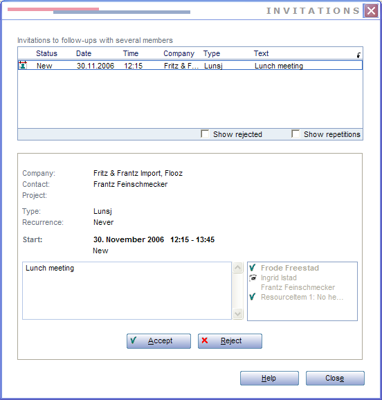

Accepting an invitation involves changing the type of the appointment.

 

Here is Ingrid Istad about to accept an invitation to an appointment from Frode Freestad.

An invitation has type = 6 (booking in diary) and status = 6 or 7 (notSeen and seen).

 

Here is what happens when the ACCEPT button is clicked:

 

Update invitation appointment
-----------------------------

```SQL
UPDATE CRM5."appointment" SET "appointment_id" = 740, "contact_id" = 13, "person_id" = 42, "associate_id" = 10, "group_idx" = 5, 
"registered" = 1164896595, "registered_associate_id" = 7, "done" = 0, "do_by" = 1164888900, "leadtime" = 0, "task_idx" = 8, 
"priority_idx" = 0, **"type" = 1, "status" = 1,** 
"private" = 0, "alarm" = 0, "text_id" = 389, "project_id" = 0, "mother_id" = 739, "document_id" = 0, 
"color_index" = 0, "opportunity_id" = 0, "invitedPersonId" = 18, "activeDate" = 1164888900, "endDate" = 1164894300, 
"lagTime" = 0, "source" = 0, "userdef_id" = 0, "userdef2_id" = 0, "updated" = 1164904435, "updated_associate_id" = 10, 
"updatedCount" = 2, "activeLinks" = 0, "recurrenceRuleId" = 0, "location" = '', "alldayEvent" = 0, 
"freeBusy" = 0, "rejectCounter" = 0, "emailId" = 0, "rejectReason" = '', "hasAlarm" = 0, "assignedBy" = 0 
WHERE "appointment_id" = 740

INSERT INTO CRM5."traveltransactionlog" 
("traveltransactionlog_id", "ttime", "prev_record_id", "type", "associate_id", "tablenumber", "record_id") 
VALUES (110522, 1164908036, 0, 4608, 10, 9, 740)
```

Update SAINT counters for the contact
-------------------------------------

```SQL
UPDATE CRM5."countervalue" SET "CounterValue_id" = 16402, "contact_id" = 13, "person_id" = 0, "project_id" = 0, 
"extra1_id" = 0, "extra2_id" = 0, "record_type" = 1, "direction" = 3, "intent_id" = 0, "sale_status" = 0, "amountClassId" = 0, 
"totalReg" = 1, "totalRegInPeriod" = 1, "notCompleted" = 1, "notCompletedInPeriod" = 1, "lastRegistered" = 1164888900, "lastCompleted" = 0, "lastDoBy" = 1164888900, 
"extra1_count" = 0, "extra2_count" = 0, "extra3_count" = 0, "extra4_count" = 0, 
"registered" = 0, "registered_associate_id" = 0, "updated" = 1164904436, "updated_associate_id" = 10, "updatedCount" = 0 WHERE "CounterValue_id" = 16402

UPDATE CRM5."countervalue" SET "CounterValue_id" = 16406, "contact_id" = 13, "person_id" = 0, "project_id" = 0, "extra1_id" = 0, "extra2_id" = 0, "record_type" = 1, "direction" = 3, "intent_id" = 5, "sale_status" = 0, "amountClassId" = 0, "totalReg" = 1, "totalRegInPeriod" = 1, "notCompleted" = 1, "notCompletedInPeriod" = 1, "lastRegistered" = 1164888900, "lastCompleted" = 0, "lastDoBy" = 1164888900, "extra1_count" = 0, "extra2_count" = 0, "extra3_count" = 0, "extra4_count" = 0, "registered" = 0, "registered_associate_id" = 0, "updated" = 1164904436, "updated_associate_id" = 10, "updatedCount" = 0 WHERE "CounterValue_id" = 16406

UPDATE CRM5."countervalue" SET "CounterValue_id" = 16591, "contact_id" = 13, "person_id" = 0, "project_id" = 0, "extra1_id" = 0, "extra2_id" = 0, "record_type" = 10, "direction" = 3, "intent_id" = 0, "sale_status" = 0, "amountClassId" = 0, "totalReg" = 1, "totalRegInPeriod" = 1, "notCompleted" = 1, "notCompletedInPeriod" = 1, "lastRegistered" = 1164888900, "lastCompleted" = 0, "lastDoBy" = 1164888900, "extra1_count" = 0, "extra2_count" = 0, "extra3_count" = 0, "extra4_count" = 0, "registered" = 0, "registered_associate_id" = 0, "updated" = 1164904436, "updated_associate_id" = 10, "updatedCount" = 0 WHERE "CounterValue_id" = 16591

UPDATE CRM5."countervalue" SET "CounterValue_id" = 16595, "contact_id" = 13, "person_id" = 0, "project_id" = 0, "extra1_id" = 0, "extra2_id" = 0, "record_type" = 10, "direction" = 3, "intent_id" = 5, "sale_status" = 0, "amountClassId" = 0, "totalReg" = 1, "totalRegInPeriod" = 1, "notCompleted" = 1, "notCompletedInPeriod" = 1, "lastRegistered" = 1164888900, "lastCompleted" = 0, "lastDoBy" = 1164888900, "extra1_count" = 0, "extra2_count" = 0, "extra3_count" = 0, "extra4_count" = 0, "registered" = 0, "registered_associate_id" = 0, "updated" = 1164904436, "updated_associate_id" = 10, "updatedCount" = 0 WHERE "CounterValue_id" = 16595
```
