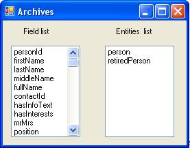
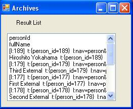

<properties date="2016-05-11"
SortOrder="91"
/>

It is necessary to query data from a database when writing your own applications. Archive providers are designed to satisfy this need. Archive providers handle the complex business logic of filtering and flattening the complex relationships in the database into a simple flat table. The following example demonstrates how a PersonProvider is used to query data from the database.

 

```
using SuperOffice;
using SuperOffice.CRM.ArchiveLists;
 
using(SoSession newSession = SoSession.Authenticate("SAL0", ""))
{
 
    SuperOffice.CRM.ArchiveLists.IArchiveProvider personArchive =
new PersonProvider();
 
    //Get the list of columns handled by this provider
    List<ArchiveColumnInfo> availableColumns =
personArchive.GetAvailableColumns();
   
    //Get the list of Entities supported by this provider
    List<ArchiveEntityInfo> availableEntities =
personArchive.GetAvailableEntities();
   
    //Display the list of column names and entity names in two list
boxes
    foreach (ArchiveColumnInfo columninfo in availableColumns)
    {
        FieldsListBox.Items.Add(columninfo.Name);
    }
    foreach (ArchiveEntityInfo entityinfo in availableEntities)
    {
        entitiesListBox.Items.Add(entityinfo.Name);
    }
 
    //Set the columns that needs to be returned
    personArchive.SetDesiredColumns("personId", "fullName",
"personUdef:SuperOffice:6", "personUdef:SuperOffice:1");
    //set the paging properties of the provider.
    personArchive.SetPagingInfo(10, 0);
 
    personArchive.SetOrderBy(new ArchiveOrderByInfo("contactId",
SuperOffice.Util.OrderBySortType.DESC),
    new ArchiveOrderByInfo("personUdef:SuperOffice:6",
SuperOffice.Util.OrderBySortType.ASC));
    //An array of restrictions with an implicit and inbetween them.
    personArchive.SetRestriction(new
ArchiveRestrictionInfo("personId", ">", "50"),
    new ArchiveRestrictionInfo("personUdef:SuperOffice:6", "=",
"1"));
    //Display the retreived data in another list box 
    int rowNo = 1;
    foreach (ArchiveRow row in personArchive.GetRows())
    {
        if (rowNo == 1)
        {
            foreach (KeyValuePair<string, ArchiveColumnData>
column in row.ColumnData)
            {
                resultsListbox.Items.Add(column.Key);
            }
        }
        foreach (KeyValuePair<string, ArchiveColumnData>
column in row.ColumnData)
        {
            resultsListbox.Items.Add(column.Value.ToString());
        }
        ++rowNo;
    }
   
}
```

Here we have initially created an Archive provider of type Person. PersonProvider is a specially designed archive provider. It is possible to retrieve the list of columns that can be handled by this archive provider through the GetAvailableColumns() method of the archive provider. Similarly the Entities that are supported by this Archive provider can also be retrieved via the GetAvailableEntities() method. The methods GetAvailableColumns() and GetAvailableEntities() return data lists of type  ArchiveColumnInfo and ArchiveEntityInfo respectively.  In the above example we have retrieved the ColumnInfo and EntityInfo from the PersonProvider and displayed them in two Listboxes.



Finally we have retrieved the set of rows satisfying the above query and displayed them in another Listbox.

  
