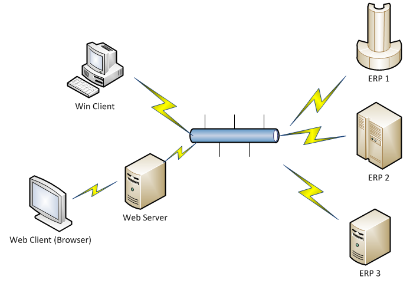

<properties date="2016-05-11"
SortOrder="47"
/>

1. autolist

Connect *or* vs Connect *ion*
-----------------------------

An ERP **connector** is a piece of code that implements one or more of the required interfaces
* It will generally be the «glue» between SuperOffice and one kind of ERP system (Baan, Dynamics, ...)
* It is a dll/web service

A **connection** is a connector + config information
* It is points to a particular ERP Connector
* Client (if there are multiple client companies in the ERP system)
* Authentication
* Other config info that might be needed to connect
