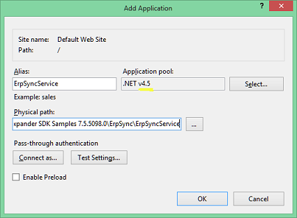
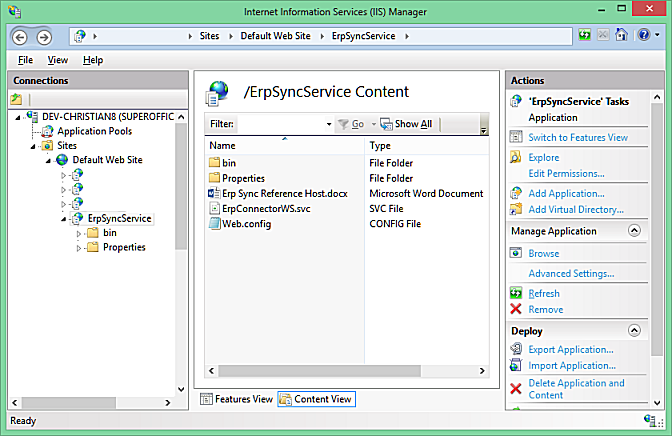

<properties date="2016-05-11"
SortOrder="5"
/>

ERP Sync Service WCF Host
-------------------------


In order to make life a little simpler for sync connector implementers, SuperOffice provides a WCF host called "Erp Sync Service" that takes plugins in the form on the .net IErpConnector interface. The WCF host handles translation between the WCF types used in IERpConnectorWS and the .net `IErpConnector` interface. The WCF host needs the **SuperOffice.Plugins.DLL** since that defines the `IErpConnector` interface.

The `ErpConnectorWS.svc` must be configured to load your `IErpConnector` implementation via the web.config file for the service. The path to your plugin DLL is specified in the `applicationSettings` section. The ErpConnectorWS service will load all the assemblies specified here, and then check the loaded classes, and add the ones marked with a `[Plugin]` derived-attribute, and which inherit from the `IPlugin` interface (which the `IErpConnector` interface does).

Setting up the WCF Host
-----------------------

To set up the WCF host, you need to place the SVC file and the associate BIN folder somewhere, and point IIS at the folder. The WCF files are installed into your documents folder, under the **My Documents\\Expander SDK Samples\\ErpSync\\ErpSyncService**.
You should copy the ErpSyncService folder to a location where the IIS NetworkService user can read it. (Your personal folders are not web accessible).

Use Visual Studio to build the project. You may need to fix the reference to the **SuperOffice.Plugins.DLL**.

Once building is successful, you can use Visual Studio to deploy to IIS, or you can make an application using IIS Control Panel.



Remember to make Application pool .net 4.0 or better, since SuperOffice.Plugins is .net 4.0 DLL.



Once the IIS is set up, you should be able to browse to the web site and see the web service page.

Configuring the WCF Host
------------------------

The WCF Host by itself cannot do any ERP Sync'ing. It needs to be filled with plugins that implement the `IErpConnector` interface. We add these plugins using the WCF host's web.config file:

```
  <applicationSettings>
    <ErpSyncService.Properties.Settings>
      <setting name="ConnectorAssemblies" serializeAs="Xml">
        <value>
          <ArrayOfString
xmlns:xsi="http://www.w3.org/2001/XMLSchema-instance"
            xmlns:xsd="http://www.w3.org/2001/XMLSchema">
            <string>
              
c:\Samples\ErpSync\SuperOffice.EIS.DummyConnector\bin\Debug\SuperOffice.EIS.DummyConnector.dll
            </string>
          </ArrayOfString>
        </value>
      </setting>
    </ErpSyncService.Properties.Settings>
  </applicationSettings>
```

 

The WCF Host will need to store its configuration data somewhere. This writeable folder is also specified in the web.config:

```
  <appSettings>
    <add key="ConfigFolder" value="
c:\Samples\erpSyncConfig"/>
  </appSettings>
```

This setting tells the WCF host to store the configuration settings in the given folder. The default implementation for configuration settings uses Isolated storage, which can be tricky to use with services which do not have their own profile folders.

The WCF Host provides its own implementation for saving configuration data using the `FileConfigDataStore` class. This class reads a directory path from the web.config file and stores connection settings in sub-folders.

IErpConnector implementation
----------------------------

The .net connector interface is a little easier to work with than the raw SOAP interface

      public CRM.PluginResponseInfo SaveConnection(Guid connectionID,
    Dictionary<string, string> connectionInfo)
      {
         ConfigDataHelper.SaveData<DummyArguments>(connectionID,
    connectionInfo);
         var resp =
    ResponseHelper.CreateOkResponse<CRM.PluginResponseInfo>();
         return resp;
      }

The WCF host has unpacked the parameters for us, and handles conversion between the .net types and the WS-types used in the SOAP API. Any exceptions in the `IErpConnector` plugin are caught and converted into SOAP responses.
The `ConfigDataHelper` uses the `FileConfigDataStore` to store the settings for us.

The major benefit of writing Sync services using the `IErpConnector` interface is that you can load them directly into SM.web for debugging. See the [Debugging Tips](../Tips%20for%20Development.md) for more info.
