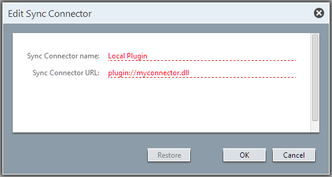

<properties date="2016-05-11"
SortOrder="23"
/>

[Tips for Development]()
=====================================

### [Using your own connector host]()

Although we recommend that connector developers use the connector web-service host, it’s not a requirement. Reasons for not using it may include needing to host a Sync Connector in an environment not compatible with a .Net web service, or simply preferring to work in a non-.Net programming environment such as Java.

If you choose to not use the connector host, you will need to expose a slightly different interface than IErpConnector (described below). There is a web-service version of the `IErpConnector` interface named `IErpConnectorWS` which contains all contracts used for communication between SuperOffice and a connector web service, and this is what you’ll need to expose through your connector service. Similarly, there are web service versions of all related classes and interfaces, such as `ErpActorWS`, `FieldMetadataInfoWS`, and so on.

All these classes are defined in **SuperOffice.Plugins.dll**, so if you are writing your custom host in .Net you can still take advantage of SuperOffice’s implementations.

Note: If you choose to go with your own web-service host, you are not required to use the IErpConnector interface. `IErpConnector` is the communication interface between the connector host supplied by SuperOffice and its hosted connector(s).

All the SuperOffice clients care about is that it implements the `IErpConnectorWS` SOAP interface (and its related contracts, classes, etc) and makes it accessible through a SOAP web service.

### [Directly loading connector implementations for debugging]()

If you choose to use the SuperOffice-provided connector host, then your connector implementation will implement the IErpConnector interface. In this case, it is also possible to directly load the implementation into your SuperOffice website, instead of running a separate site for the connector host. This can make certain kinds debugging easier and saves the setup of a site, though it also means that each rebuild of the connector assembly causes the SuperOffice website to recycle, which can take a lot of time. In most cases, **using the connector host with a separate Application Pool is the recommended and most realistic configuration**.

To utilize direct-loading, you need to

a)       Include your connector assembly in the &lt;dynamicLoad&gt; section in web.config

b)       Instead of a site URL for the connector, use plugin://&lt;connectorname&gt;, where &lt;connectorname&gt; represents the name given in the ErpConnector attribute on the implementing class.

The plugin loader used by the connector host is part of the **SuperOffice.Plugins.DLL** assembly that is also present in the normal website, and the same loading code is run.

Having the connector loaded directly can make debugging simpler, since there are fewer 'moving parts'.

If you attempt to use this connection from the windows client you will get an error. The windows client and the Travel Gateway both require that you use a URL to connect to the sync service.

 

