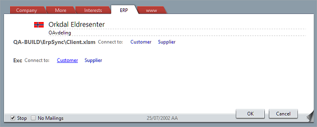
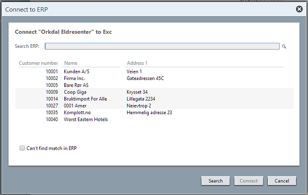
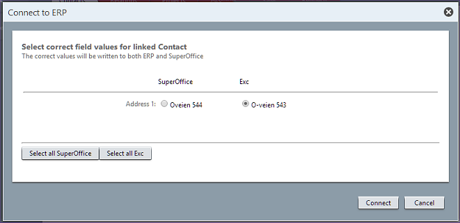

<properties date="2016-05-11"
SortOrder="10"
/>

Connecting a Company
--------------------



Connecting a SuperOffice entity (Company/Person/Project) is started by clicking EDIT and clicking the right **Actor Type** link.

The list of Actor Type links is determined by the `GetSupportedActorTypes` call [made when the connection was set up](Setting%20up%20Connector.md).

Clicking the link shows the **Connect to ERP** dialog. The dialog calls the `GetSearchableFields` function to find out what columns to present in the results list.

```
  StringArrayPluginResponse GetSearchableFields(Guid connectionId,
string actorType)

     connectionId = {3aef3af6-8642-4fc1-8dc9-4e08bd76a6bf}
     actorType: "Customer"

  returns:
      IsOk = true
      Items
        [0] = "NUMBER1"
        [1] = "NAME"
        [2] = "ADDRESS1"
```



After getting a list of columns, the SuperOffice client calls the `SearchActors` method to find out if there are any customers in the ERP with the same name. The connector is free to implement the search as it wants. It would be nice if the results were filtered accoring to the parameters, but this is not required.

```
   ActorArrayPluginResponse  SearchActors(
                                    Guid connectionID, 
                                    string actorType, 
                                    string searchText, 
                                    string[] fieldKeys )

     connectionId = {3aef3af6-8642-4fc1-8dc9-4e08bd76a6bf}
     actorType = "Customer"
     searchText = "Orkdal Eldresenter":
     fieldKeys:
        [0] = "NUMBER1"
        [1] = "NAME"
        [2] = "ADDRESS1"

  returns:
      IsOk = true
      Actors:
        [0] = { ActorType = "Customer", ErpKey = "erp831",
                LastModified = "103423595", 
                FieldValues = { 
                        ["NAME"] = "Orkdal Senter AS",
                        ["NUMBER1"] = "4343321",
                        ["ADDRESS1"] = "x2" }
```

The returned actors are displayed in the results grid in the dialog.
### Searching

If the user enters a different name, a new call to `SearchActors` is made, and the results are updated.

If the user clicks the **Advanced Search** button, then the search dialog appears, and a call is made to `SearchActorsAdvanced` in the same way as [during Import](Importing.md#search).

If the user selects one of the actors and clicks the CONNECT button, then the full Actor is retrieved from the ERP system using `GetActors`.

```
   ActorArrayPluginResponse GetActors(
                                    Guid connectionID, 
                                    string actorType, 
                                    string[] erpKeys, 
                                    string[] fieldKeys )

     connectionId = {3aef3af6-8642-4fc1-8dc9-4e08bd76a6bf}
     actorType = "Customer"
     erpKeys:
        [0] = "erp831"
     fieldKeys:
        [0] = "NAME"
        [1] = "NUMBER1"
        [2] = "SUPPLIERLIMIT"
        [3] = "STDTERMS"
        [4] = "ADDRESS1"

  returns:
      IsOk = true
      Actors:
        [0] = { ActorType = "Customer", ErpKey = "erp831",
                LastModified = "103423595", 
                FieldValues = { 
                        ["NAME"] = "Orkdal Senter AS",
                        ["NUMBER1"] = "4343321",
                        ["STDTERMS"] = "60",
                        ["SUPPLIERLIMIT"] = "x2" }
                        ["ADDRESS1"] = "Oveien 544" }
```

If some of the ERP Actor values conflict with the SuperOffice entity, then these are displayed in the dialog:


The user can select the values that they want to use, and the SuperOffice database is updated with new values.
Updating ERP
------------

The ERP system is updated with the new values using a second call to `GetActors`, followed by a call to `SaveActors`.
```
   ActorArrayPluginResponse GetActors(
                                    Guid connectionID, 
                                    string actorType, 
                                    string[] erpKeys, 
                                    string[] fieldKeys )

     connectionId = {3aef3af6-8642-4fc1-8dc9-4e08bd76a6bf}
     actorType = "Customer"
     erpKeys:
        [0] = "erp831"
     fieldKeys:
        [0] = "NAME"
        [1] = "NUMBER1"
        [2] = "SUPPLIERLIMIT"
        [3] = "STDTERMS"
        [4] = "ADDRESS1"

  returns:
      IsOk = true
      Actors:
        [0] = { ActorType = "Customer", ErpKey = "erp831",
                LastModified = "103423595", 
                FieldValues = { 
                        ["NAME"] = "Orkdal Senter AS",
                        ["NUMBER1"] = "4343321",
                        ["STDTERMS"] = "60",
                        ["SUPPLIERLIMIT"] = "x2" }
                        ["ADDRESS1"] = "Oveien 543" }
```

The SuperOffice client will update the Actor with new values depending on what the user selected in the dialog, and then call `SaveActors`.
```
   ActorArrayPluginResponse SaveActors(
                                    Guid connectionID, 
                                    ErpActor[] actors )

     connectionId = {3aef3af6-8642-4fc1-8dc9-4e08bd76a6bf}
     actors:
        [0] = { ActorType = "Customer", ErpKey = "erp831",
                LastModified = "103423595", 
                FieldValues = { 
                        ["NAME"] = "Orkdal Eldresenter",
                        ["NUMBER1"] = "4343321",
                        ["STDTERMS"] = "60",
                        ["SUPPLIERLIMIT"] = "x2" }
                        ["ADDRESS1"] = "Oveien 544" }

  returns:
      IsOk = true
      Actors:
        [0] = { ActorType = "Customer", ErpKey = "erp831",
                LastModified = "103423595", 
                FieldValues = { 
                        ["NAME"] = "Orkdal Eldresenter",
                        ["NUMBER1"] = "4343321",
                        ["STDTERMS"] = "60",
                        ["SUPPLIERLIMIT"] = "x2" }
                        ["ADDRESS1"] = "Oveien 544" }
```

The link between the SuperOffice entity and the actor is stored in the SuperOffice database.

If the user can't find a match in the ERP system, they can [create a company in ERP](Creating%20a%20Company.md) based on the SuperOffice company.
