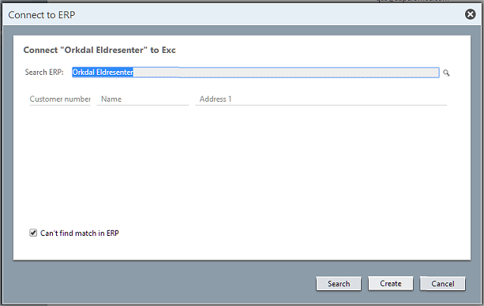
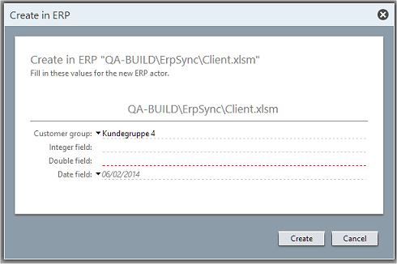

<properties date="2016-05-11"
SortOrder="11"
/>

Creating a Company
------------------



If the user can't find a match in the ERP system, they check the **Can't find match in ERP** checkbox.

The CONNECT button changes to CREATE.

The user is presented with a dialog where they can fill in the defaults. The list of fields to present and the suggested default values are stored in the SuperOffice database.



After the user has filled in the ERP fields, the SuperOffice client calls the connector's `CreateActor` to create the actor, and to get back the ERP ID for the new actor:

```
   ActorPluginResponse  CreateActor(
                              Guid connectionID, 
                              ErpActor actor )

     connectionId = {3aef3af6-8642-4fc1-8dc9-4e08bd76a6bf}
     actor = { ActorType = "Customer", ErpKey = "",
               LastModified = "", 
               FieldValues = { 
                        ["NAME"] = "Orkdal Eldresenter AS",
                        ["NUMBER1"] = "4343321",
                        ["ADDRESS1"] = "x2" }

  returns:
      IsOk = true
      Actor = { ActorType = "Customer", ErpKey = "erp831",
                LastModified = "103423595", 
                FieldValues = { 
                        ["NAME"] = "Orkdal Eldresenter AS",
                        ["NUMBER1"] = "4343321",
                        ["ADDRESS1"] = "x2" }
```

The returned actor's ERP Key and last-modified date are stored in the SuperOffice database, and the link is created.
