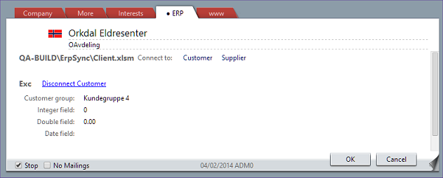

<properties date="2016-05-11"
SortOrder="20"
/>

Disconnecting a Company
-----------------------

Once connected, the link in EDIT mode changes to a **DISCONNECT (ERP Type)** link.

Clicking the link shows a confirmation dialog.

Answering YES to disconnect from the ERP system does not call the ERP sync connection.

It removes the link record from the SuperOffice database, which stops the connection being called for more information.

We do not delete information from the ERP system, just because we have stopped sync with SuperOffice.
