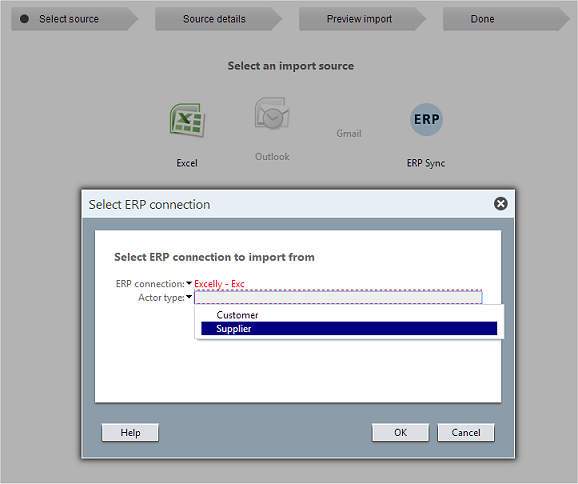
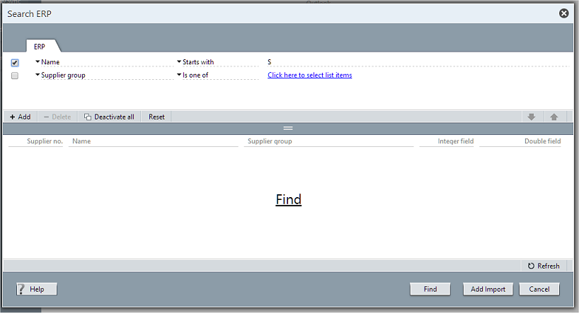

<properties date="2016-05-11"
SortOrder="4"
/>

Importing from ERP
------------------



Importing allows Admin to populate a SuperOffice database with companies/projects from the ERP system.

Selecting ERP SYNC from the import source will let you select the ERP connection to use.

The Admin client will call the ERP connector's `GetSearchableFields` for each active actor-mapping.

All the actors with one or more searchable fields are added to the actor type dropdown.

<a href="" id="search">Searching for Actors</a>
-----------------------------------------------



Search-in-ERP dialog uses the list of fields from the `GetSearchableFields` call to fill in the upper grid.

Clicking the FIND link or button will call `SearchActorsAdvanced` to do the search:

The active criteria along with the list of columns marked "Show-in-Search" are passed to the connector

```
   ActorArrayPluginResponse  SearchActorsAdvanced(
                                    Guid connectionID, 
                                    string actorType, 
                                    SearchRestrictionInfo[]
restrictions, 
                                    string[] returnFields )

     connectionId = {3aef3af6-8642-4fc1-8dc9-4e08bd76a6bf}
     actorType = "Supplier"
     restrictions:
        [0] = { FieldKey = "NAME", Operator = "begins",
ScalarValue="S" }
     returnFields:
        [0] = "NAME"
        [1] = "NUMBER1"
        [2] = "SUPPLIERLIMIT"
        [3] = "STDTERMS"

  returns:
      IsOk = true
      Actors:
        [0] = { ActorType = "Supplier", ErpKey = "erp123",
                LastModified = "103423423", 
                FieldValues = { 
                        ["NAME"] = "SuperOffice AS",
                        ["NUMBER1"] = "4343321",
                        ["SUPPLIERLIMIT"] = "x2" }
        
        [1] = { ActorType = "Supplier", ErpKey = "erp594",
                LastModified = "1034232063", 
                FieldValues = { 
                        ["NAME"] = "Sandtander SA",
                        ["NUMBER1"] = "865421",
                        ["STDTERMS"] = "30",
                        ["SUPPLIERLIMIT"] = "x0" }
        
        
```

The field keys and return fields use the field key identifiers returned by the call to `GetSupportedActorTypeFields`.

If there are list items in the returned columns, then the display values for these columns are fetched by calling the `GetListItems`.

Timestamps
----------

The actors returned by the search are identified by two values:
* **ErpKey** - is the id of the actor in the ERP system. This is a string, not an int or a GUID. The id should be stable over time. i.e. Editing the name of the company in the ERP system should not change the ErpKey.
* **LastModified** - is the timestamp. This value is recorded when an ERP Actor is linked to a SuperOffice entity. The timestamp value is sent back to the connector when synchronizing, so that the connector can figure out what was changed last. The timestampt is not parsed or understood by SuperOffice -- it is for the ERP Sync connector to understand.

Importing
---------

The actual import is done by calling the ERP Sync connector's `GetActors` with the chosen ERP Keys. The connector must populate and return the ERP Actor objects. SuperOffice will create entities in the database and create the links to the ERP actors.
```
   ActorArrayPluginResponse  GetActors(
                                    Guid connectionID, 
                                    string actorType, 
                                    string[] erpKeys, 
                                    string[] fieldKeys )

     connectionId = {3aef3af6-8642-4fc1-8dc9-4e08bd76a6bf}
     actorType = "Supplier"
     erpKeys:
        [0] = "erp123"
        [1] = "erp594"
     fieldKeys:
        [0] = "NAME"
        [1] = "NUMBER1"
        [2] = "SUPPLIERLIMIT"
        [3] = "STDTERMS"

  returns:
      IsOk = true
      Actors:
        [0] = { ActorType = "Supplier", ErpKey = "erp123",
                LastModified = "103423423", 
                FieldValues = { 
                        ["NAME"] = "SuperOffice AS",
                        ["NUMBER1"] = "4343321",
                        ["STDTERMS"] = "",
                        ["SUPPLIERLIMIT"] = "x2" }
        
        [1] = { ActorType = "Supplier", ErpKey = "erp594",
                LastModified = "1034232063", 
                FieldValues = { 
                        ["NAME"] = "Sandtander SA",
                        ["NUMBER1"] = "865421",
                        ["STDTERMS"] = "30",
                        ["SUPPLIERLIMIT"] = "x0" }
```
