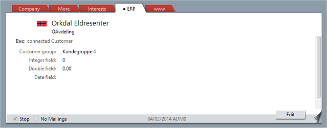

<properties date="2016-05-11"
SortOrder="15"
/>

Viewing a Company
-----------------



The connection links the SuperOffice id with the ERP's actor type and ERP key.

Once a connection has been created, the connection is called whenever the ERP card is viewed.

The SuperOffice client calls `GetActors` for the card being viewed, requesting the fields marked "show in ERP card". Any list items that need to be shown are turned into text values by calling `GetListItems`.

```
   ActorArrayPluginResponse GetActors(
                                    Guid connectionID, 
                                    string actorType, 
                                    string[] erpKeys, 
                                    string[] fieldKeys )

     connectionId = {3aef3af6-8642-4fc1-8dc9-4e08bd76a6bf}
     actorType = "Customer"
     erpKeys:
        [0] = "erp831"
     fieldKeys:
        [0] = "CUSTGR"
        [1] = "NUMBER1"
        [2] = "DOUBLE"
        [3] = "DATE"

  returns:
      IsOk = true
      Actors:
        [0] = { ActorType = "Customer", ErpKey = "erp831",
                LastModified = "103423595", 
                FieldValues = { 
                        ["CUSTGR"] = "G4",
                        ["NUMBER1"] = "[I:0]",
                        ["DOUBLE"] = "[D:0.0]",
                        ["DATE"] = "" }
```

The returned actors are displayed in the ERP tab under the connection name heading.
