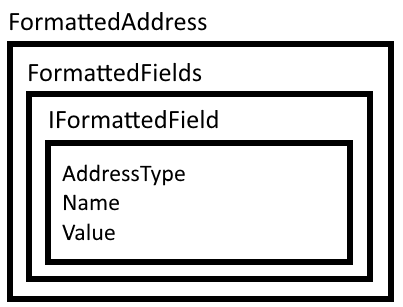

# Address Formats and AddressFormatter

Depending on where you live in the world, a company or person address can come in various shapes and sizes. SuperOffice CRM supports these various shapes and sizes using address format definitions for each country and region in the database.

This document first explores how address formats are relevant, and then introduces the AddressFormatter class to help working with the complexities of address formats.

## Introduction

Due to the dynamic nature of addresses, address fields in the SuperOffice CRM UI appear differently depending on the selected country for any particular company or person.

Below is an example of six different country formats and how they appear in SuperOffice CRM. It is interesting to note that while the top two are similar, the middle two are also similar but different from the first two. The bottom two are uniquely different from both each other and the other four.


To support multiple address variants, SuperOffice address data structures must be generic, and an address type must be flexible enough to support all the various address formats of the world.

SuperOffice has accomplished supporting multiple country address formats by abstracting the address format from the address data, and storing each seperately in the database. At runtime the address format is selected based on the company or contact county information.

In NetServer core, the datatype used to express a single address format is **SuperOffice.CRM.Globalization.FormatterAddress** class.



A FormattedAddress is a collection of FormattedFields datatypes, which contain one or more IFormattedField types. Each IFormattedField contains the actual address data. Each IFormattedField contains, among others, three key properties: AddressType, Name and Value.

AddressType determines which type of address a field belongs to, of which there are three possibilities:

1. ContactPostalAddress
2. ContactStreetAddress
3. PersonStreetAddress

The first two types correspond to a company address, used to differentiate a company's postal address versus its' physical, or visiting, address. The third address type represents a contact person address.

The Name and Value properties are just what they sound like; the name is a unique field keyname, and the value is populated with the value from the database.

For example, the address format of Norway defines 4 lines total. The first and third lines contain just one element, while the second and fourth lines containing two elements.

France, however, has 3 lines total, with the first and second lines containing just one field element and the third line containing two field elements.


It is important to understand that some company addresses contain only a postal address while others contain both a postal and street address.

Because line elements are simply array containers, each field has an AddressType property that signals whether it pertains to a contact postal or street address, or a person address.

So how does one go about reading and writing address information using this generic construct? Use the AddressFormatter class!

# Address Formatter

The **AddressFormatter** class provides the following functions to format addresses:

* FormatContact
* FormatPerson
* FormatQuote

Reading the FormattedAddress data structure is very straightforward. Simply loop over the FormattedAddress lines and print out each IFormattedField from FormattedFields. The following code example demonstrates using AddressFormatter to get a formatted representation of a contacts address, then loops over each line and prints out each address field.

```csharp
using SuperOffice;
using SuperOffice.CRM.Entities;
using SuperOffice.CRM.Globalization;
using SuperOffice.CRM.Security;

using(SoSession session = SoSession.Authenticate("SAL0", ""))
{
  // get company ID 4
  Contact company = Contact.GetFromIdxContactId(4);

  // format the address of the contact to the format of the
  // country that the conatct belongs to

  var formatedAddress = AddressFormatter.FormatContact(company);

  foreach (FormattedFields fs  in formatedAddress)
  {
    foreach (IFormattedField f in fs)
    {
       Console.WriteLine(f.Name +  " " + f.Value);
    }

    Console.WriteLine();
  }
}

// outputs
//---------
//StreetAddress1: A-gata 23
//StreetZipcode: 0123
//StreetCity: OSLO
```

Now look at a ContactRow. Because **ContactRow** only contacts properties from the contact table, it does not contain an Address property. To get a FormattedAddress from a ContactRow, the AddressFormatter expects an AddressRow as well.

```csharp
using SuperOffice.CRM.Globalization;
using SuperOffice.CRM.Security;
using SuperOffice.CRM.Rows;
using SuperOffice;

using(SoSession session = SoSession.Authenticate("SAL0", ""))
{
  // retrive the contact row no 4

  ContactRow conRow = ContactRow.GetFromIdxContactId(4);

  // get the postal address of the contact row no 4

  AddressRow postalAddress = AddressRow.GetFromIdxOwnerIdAtypeIdx(4, SuperOffice.Data.AddressType.ContactPostalAddress);

  // get the street address of the contact row no 4

  AddressRow streetAddress = AddressRow.GetFromIdxOwnerIdAtypeIdx(4, SuperOffice.Data.AddressType.ContactStreetAddress);

  // format the address according to the country that the contact belong to

  FormattedAddress formatedAddress = AddressFormatter.FormatContact(conRow, postalAddress, streetAddress);
}
```

You can see we have done the same thing using only rows. The FormatContact method converts the postal and street address to the format of the country that the contact belongs to. The example uses the AddressRow.GetFromIdxOwnerIdAtypeIdx method to get the desired contact address type.

Listed below are two groups of pre-defined address field names, one for person and one for contact.

| Person Address Types | Contact Address Types | Quote Address Types|
|---------------------------|----------------------------|----------------------|
| Address1                  | PostalAddress1             |BillingAddress1       |
| Address2                  | PostalAddress2             |BillingAddress2       |
| Address3                  | PostalAddress3             |BillingAddress3       |
| City                      | PostalCity                 |BillingCity           |
| County                    | PostalCounty               |BillingCounty         |
| State                     | PostalState                |BillingState          |
| Zipcode                   | PostalZipcode              |BillingZipcode        |
|                           | StreetAddress1             |ShippingAddress1      |
|                           | StreetAddress2             |ShippingAddress2      |
|                           | StreetAddress3             |ShippingAddress3      |
|                           | StreetCity                 |ShippingCity          |
|                           | StreetCounty               |ShippingCounty        |
|                           | StreetState                |ShippingState         |
|                           | StreetZipcode              |ShippingZipcode       |


Writing address information back to this data structure is not useful. There is no way to persist changes to a **FormattedAddress** back to the database. Therefore, when writing code inside NetServer core use the Contact and Person entity types to persist address changes. Both entity types expose an Address property with Relevant properties for dealing with respective address formats.

```csharp
// Example Person Address
Person person = Person.GetFromIdxPersonId(3);
person.Address.Address1 = "A-gata 23";
person.Address.City     = "OSLO";
person.Address.Zipcode  = "0123";
person.Save();

// Example Contact Address
Contact contact = Contact.GetFromIdxContactId(3);
contact.PostalAddress.Address1 = "";
contact.PostalAddress.Address2 = "";
contact.PostalAddress.Address3 = "";
contact.PostalAddress.City     = "";
contact.PostalAddress.County   = "";
contact.PostalAddress.Zipcode  = "";
//----------------------------------
contact.StreetAddress.Address1 = "";
contact.StreetAddress.Address2 = "";
contact.StreetAddress.Address3 = "";
contact.StreetAddress.City     = "";
contact.StreetAddress.County   = "";
contact.StreetAddress.Zipcode  = "";
contact.Save();
```

## Conclusion

Working with address information in SuperOffice CRM had never been easier. Hopefully now you understand the FormattedAddress structure, its' madness, and know better how to deal with it in future projects.
