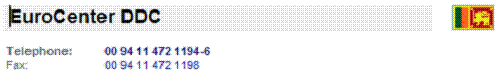

# Phone Formatter

The phone formatter class contains various methods used to format phone numbers. 



## Get International Number

The **GetInternationalNumber** method return the international number of the specified phone number. The following example specifies a country ID and a local number, and then formats the local number into an international number.

```csharp
using SuperOffice.CRM.Globalization;
using SuperOffice;

using(SoSession session = SoSession.Authenticate("SAL0", ""))
{
      // get the international number of the specifed country for the given
      // phone number Country ID 578 == Norway

      string formatedPhoneNumber = PhoneFormatter.GetInternationalNumber(578, "96458551");

      // outputs
      // 4796458551
}
```

### GetBaseNumber

**GetBaseNumber** is another useful method in the phone formatter class. The example specifies the country ID and the phone number to format. The method formats to the normal phone number format of the specified country. The method removes the additional numbers and characters, and then return the base number as a string.

```csharp

using SuperOffice.CRM.Globalization;
using SuperOffice;

using(SoSession session = SoSession.Authenticate("SAL0", ""))
{
      // format the phone number to the base number format of the
      // specified country this will get rid of the additional
      // number and characters
      
      string formatedPhoneNumber = PhoneFormatter.GetBaseNumber(578, "+47 779 645 855");

      // output:
      // 779645855
}
```

### GetGSMNumber

This method returns the GSM compliant phone number formatted according to the country specified. Additionally, the method resolves the letters in the number. The V is resolved to 8, according to the standard phone key pad, and so on.

```csharp

using SuperOffice.CRM.Globalization;
using SuperOffice;

using(SoSession session = SoSession.Authenticate("SAL0", ""))
{
      // format the phone number to GSM compliant format of the given
      // country the letters of the phone number will be resolved

      string formatedPhoneNumber = PhoneFormatter.GetGSMNumber(578,"077748VISTA");
      
      // output:
      // +4707774884782
}
```

### GetLongDisplayNumber

This method is designed to format a number to the long country number format. Here the number will be formatted to the long phone number format of Norway. The method adds the country code to the phone number.

```csharp

using SuperOffice.CRM.Globalization;
using SuperOffice;

using(SoSession session = SoSession.Authenticate("SAL0", ""))
{
      // get the long dispaly number formatted accoding to the country
      // specifed the method will add the country code and the area
      // code to the number

      string formatedPhoneNumber = PhoneFormatter.GetLongDisplayNumber(578,"678657856");

      // output:
      // +47 678657856
}
```

## GetPrefix

The above method is a very simple method designed to return the country prefix of the specified country as a string. Here we retrieve the country prefix of Norway. 

```csharp
using SuperOffice.CRM.Globalization;
using SuperOffice;

using(SoSession session = SoSession.Authenticate("SAL0", ""))
{
      // get the country prefix of the country we specify
      
      string formatedPhoneNumber = PhoneFormatter.GetPrefix(578);
      
      // output:
      // +47
}
```

### ResolveAlphanumericNumber

This method is designed to resolve the alpha numeric characters in a number. Here the number will get resolved according to the standard key pad of a phone.

```csharp
using SuperOffice.CRM.Globalization;
using SuperOffice;

using(SoSession session = SoSession.Authenticate("SAL0", ""))
{
      // get the alpha numeric characters of a phone number that we specify
      // resolved this will happen according to the standard key pad
      // of phone e.g: the letters T,U and V will be replased will number 8

      string formatedPhoneNumber = PhoneFormatter.ResolveAlphanumericNumber("077 748VISTA");

      // output:
      // 077 74884782
}
```
