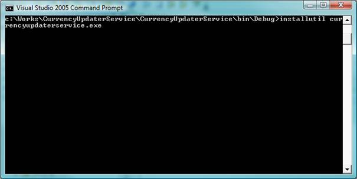

<properties date="2016-05-11"
SortOrder="9"
/>

 

To install the build windows service Open a command line window by going to Start -&gt; Programs -&gt; Microsoft Visual Studio.Net -&gt; Visual Studio.Net Tools -&gt; Visual Studio.Net Command Prompt, and change to the directory where the executable is located. Enter the following command

 `Installutil CurrencyUpdataterService.exe` 

As shown below

  

Now the service is installed. To start and stop the service, go to Control Panel -&gt; Administrative Tools -&gt; Services.  Right click the service and select Start.

To uninstall the windows service

 `Installutil /u CurrencyUpdataterService.exe` 

 

Problems: For some of the above currency codes web service does not support - mainly due to the Euro replacing the currency in question.

Those are (26)

* ADF- Franc (Andorra)
* ARP- Peso (Argentina)
* ATS- Schilling (Austria)
* BAK- Mark (Bosnia & Herzegovina)
* BEF- Franc (Belgium)
* BGL- Lev (Bulgaria)
* BRR- Real (Brazil)
* BYR- Ruble (Belarus)
* DEM- Mark (Germany)
* ERN- Nakfa (Eritrea)
* ESP- Peseta (Spain)
* FIM- Markka (Finland)
* FRF- Franc (France)
* GEL- Lari (Georgia)
* GRD- Drachma (Greece)
* IEP- Punt (Ireland)
* IRR- Rial (Iran)
* ITL- Lira (Italy)
* LUF- Franc (Luxembourg)
* MXP- Peso (Mexico)
* NLG- Dutch Guilder (Netherlands)
* PLE- Escudo (Portugal)
* PLZ- Zloty (Poland)
* RWF- Rwanda Franc (Rwanda)
* XDR- IMF Special Drawing Right
* YUN- Yugoslavia New Dinars (Montenegro)
