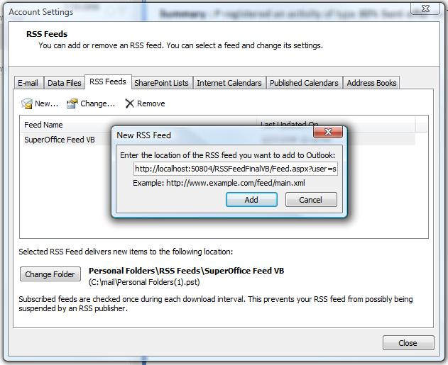

RSS feeds can be subscribed through Microsoft Office Outlook 2007. The RSS subscriptions are kept in a separate folder along with the mail folders in Outlook 2007. Once subscribed, RSS feeds can be read the same way mails are read, i.e. when you click a particular feed all the posts appear in the same format as regular email in the mail reader pane.

Following are the steps involved in subscribing RSS in Outlook 2007.

1. Go to Tools, then Account Settings.
2. Click RSS Feeds tab and Click ‘New’ to add a new RSS Feed.
3. Enter the URL of the feed as shown below.

Now you can see a folder under ‘RSS Feeds’ main folder with name of the feed.

